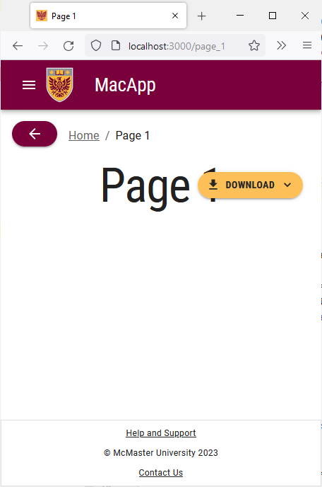
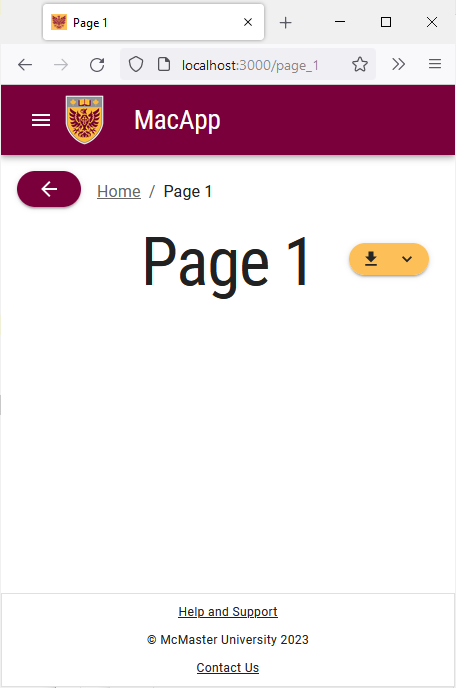

# Buttons

In some instances, you will need to reduce the size of buttons on small displays to prevent them from covering up other content or taking up too much space.
Navigate to "Page 1" and try shrinking your browser window. The "Download" button will now cover the page title.



To fix this issue, we will make the "Download" button smaller by removing the text.

Open the `app/page_1/page.tsx` file and add the following import statement:
```
import useMediaQuery from '@mui/material/useMediaQuery';
```


Replace the `import {alpha, styled} from '@mui/material/styles';`  import statement with:
```
import {alpha, styled, useTheme} from '@mui/material/styles';
```

Locate the "Download" `MacButton` component and replace the `Download` string inside of it with the following line of code :
```
{useMediaQuery(useTheme().breakpoints.up('md')) ? 'Download' : ''}
```

The button will now only show the "Download" string on display that are medium sized or larger.


