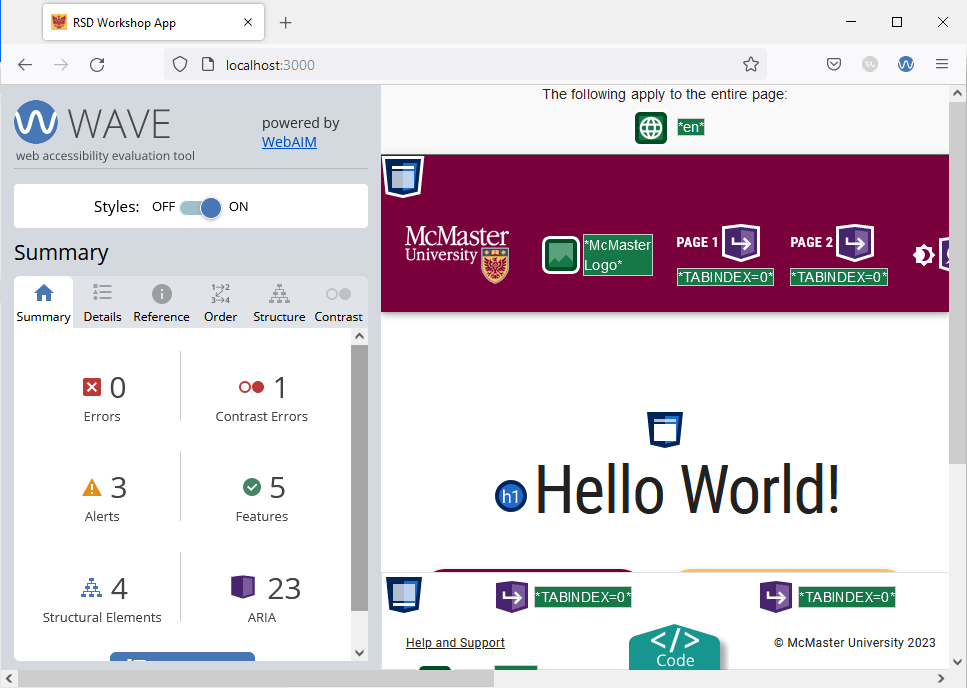
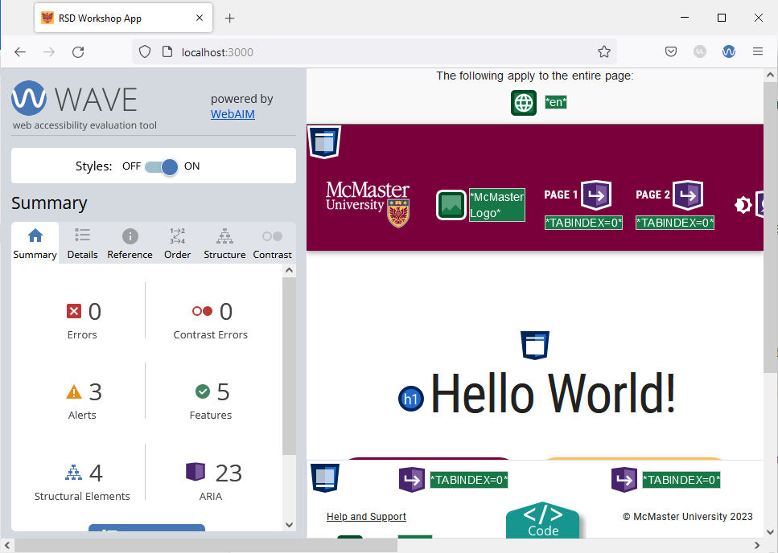

# Contrast Error

Navigate to the main page and run the WAVE tool. You will notice that the tool identifies a contrast error on this page. 



The contrast error is caused by the shade of grey used for the placeholder text on the file input widget that appears on the main page of our website. To fix the error, we will modify the file input widget to use a slightly darker shade of grey in light mode that is AODA compliant for the placeholder text. Dark mode uses a light grey color for the placeholder text to maintain visibility against a dark background.

Open the `app/page.tsx` file and add the following import statement:
```ts
import {useTheme} from '@mui/material/styles'
```
Modify the `MuiFileInput` component by adding an `sx` prop as shown below:
```ts

<MuiFileInput  
	multiple  
	placeholder="Click here and select file(s)"  
	value={selectedFiles}  
	onChange={handleChange}  
	hideSizeText 
	// setting the placeholder text color to a W3C-compliant shade of grey depending on 
	// the current theme mode (light/dark)
	sx={{  
		"& .MuiFileInput-placeholder": {  
		color:  useTheme().palette.mode === 'light' ? '#767676' : '#d3d3d3' + '!important', 
		},  
	}}  
/>

```

We used the `sx` prop to modify the color of the `placeholder` text depending on which theme mode (light/dark) is currently active. Note that we had to use the `important` CSS rule to modify the placeholder text color. Using the `important` CSS rule is often not required for standard MUI components, but it is required in this case because the `MuiFileInput` component is a third-party library that comes with some default styles that cannot be overridden without the  `important` CSS rule. 

Reload the main page in your browser and re-run the WAVE tool. The contrast error should now be fixed.



Switch to dark mode and verify that the contrast error is not present using this mode. 

Shrink your browser window and re-run the WAVE tool to verify that the mobile version of this page does not have any errors on it. 