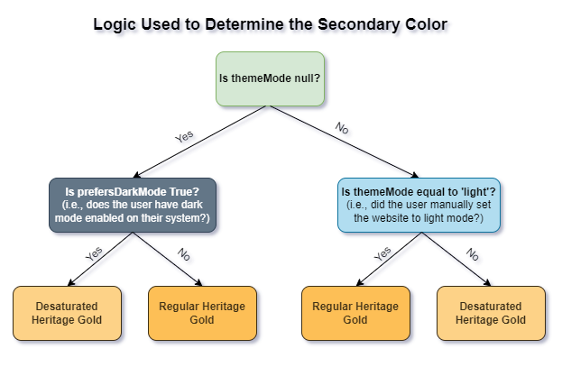
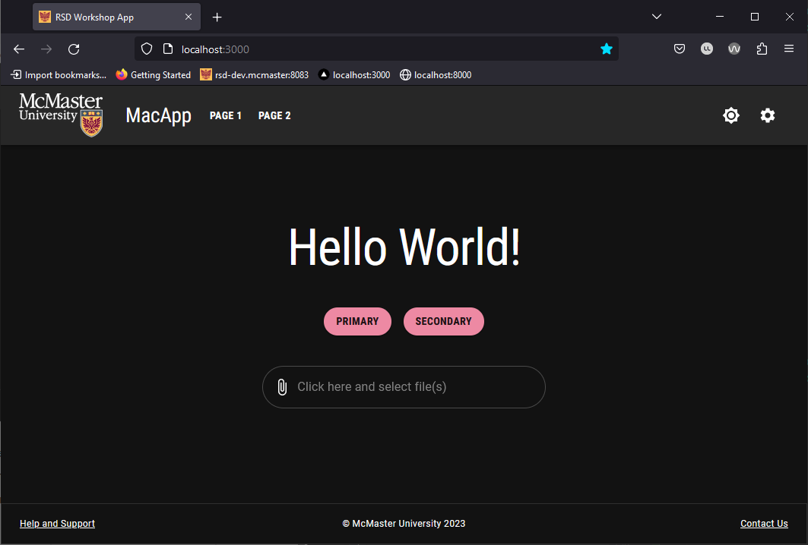
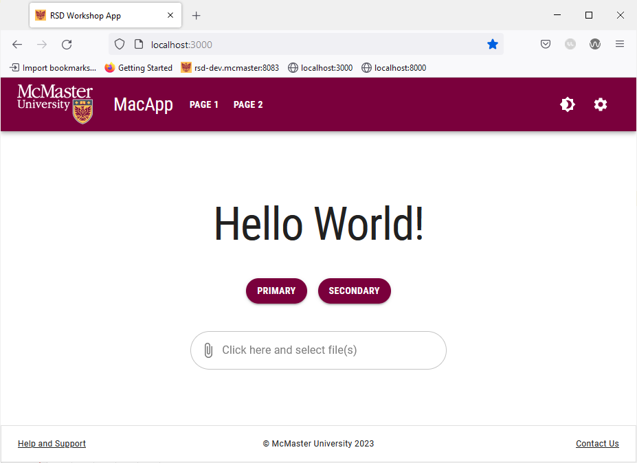

# Dark and Light Mode

A responsive website should follow the theme preference set by the user on their operating system (OS) or web browser while still allowing them to change the mode manually. In this section, we will implement the dark/light mode functionality and we will learn how to leverage the `useMediaQuery` hook and the `prefers-color-scheme` media query to enable dark mode automatically by checking the user's preference in their OS or browser settings.

## Modify `theme.ts`
We had previously set the primary and secondary colors of our theme in the `config/theme.ts` file. However, when using dark mode in our website, we will need to desaturate these colors to maintain a satisfactory level of contrast between the elements on screen and improve readability. Therefore, we will need to remove the primary and secondary color definitions from `theme.ts` since these values will now be set programmatically depending on the theme mode used.

**Delete** the following lines from `theme.ts`:
```
palette: {
    primary: {
        main: "#7a003c"
    },
    secondary: {
        main: "#fdbf57"
    }
},
```


## Modify `app/template.tsx`
Open `app/template.tsx` and add the following import statements:
```
import React from 'react'
import useMediaQuery from '@mui/material/useMediaQuery'
```

Create and export the `ColorModeContext` constant, which will allow us to read and modify the theme mode of our website from the navigation bar. The following code should be added before the `Template` function declaration:
```
export const ColorModeContext = React.createContext({
    toggleColorMode: () => {},
})
```

Next, we will determine if the user currently has dark mode enabled on their system by reading the value of the  `prefers-color-scheme` media query. We will also use the React state hook to create a `themeMode` constant with a `null` initial value and a `setThemeMode` function that is used to update the `mode` constant.

Add the following lines of the code at the top of the `App` function:
```
const prefersDarkMode = useMediaQuery('(prefers-color-scheme: dark)')

const [themeMode, setThemeMode] = React.useState<'light' | 'dark' | null>(null)
```

Replace the `const theme` declaration with the following updated declaration:
```
const theme = React.useMemo(
	() =>
		createTheme({
			...themeOptions,
			palette: {
				mode:
					themeMode == null
						? prefersDarkMode
							? 'dark'
							: 'light'
						: themeMode,
				primary: {
					main:
						themeMode == null
							? prefersDarkMode
								? '#86174E'
								: '#7a003c'
							: themeMode == 'light'
								? '#7a003c'
								: '#86174E',
				},
				secondary: {
					main:
						themeMode == null
							? prefersDarkMode
								? '#FDC566'
								: '#fdbf57'
							: themeMode == 'light'
								? '#fdbf57'
								: '#FDC566',
				},
			},
		}),
	[themeMode, prefersDarkMode]
)
```
This updated declaration utilizes the React `useMemo` hook to create and cache the theme value. The value of the `mode` attribute is determined by examining the the value of the `themeMode` constant we created earlier. The diagram below explains the conditional logic used to determine the value of `mode`:


When using dark mode, the primary and secondary colors of our theme are desaturated to retain readability and enhance contrast. The values of these colors are now determined programmatically as shown in the diagrams below:



We will now make use of the React `useMemo` hook to calculate and cache the value of the `colorMode` constant. Add the following lines of code **after** the `theme` declaration:
```
const colorMode = React.useMemo(
	() => ({
		toggleColorMode: () => {
			setThemeMode(prevMode => (prevMode == null ? (theme.palette.mode === 'dark' ? 'light' : 'dark') : prevMode === 'light' ? 'dark' : 'light'))
		},
	}),
	[theme]
)
```

Finally, wrap the returned elements of the `App` function with the `ColorModeContext.Provider`:
```
return <>
        <ColorModeContext.Provider value={colorMode}>
            <ThemeProvider theme={theme}>
              <Navbar />
              <CssBaseline />
              {children}
          </ThemeProvider>
        </ColorModeContext.Provider>
    </>
```
Your `app/template.tsx` file should now look like this:
```
'use client';

import Navbar from "@/components/Navbar/Navbar";
import CssBaseline from "@mui/material/CssBaseline";
import Footer from "@/components/Footer/Footer";
import useMediaQuery from "@mui/material/useMediaQuery";
import React from "react";
import {createTheme, ThemeProvider} from '@mui/material/styles'
import themeOptions from "@/config/theme";

export const ColorModeContext = React.createContext({
    toggleColorMode: () => {},
})

export default function Template({children}: {children?: React.ReactNode} ) {
    const prefersDarkMode = useMediaQuery('(prefers-color-scheme: dark)')

    const [themeMode, setThemeMode] = React.useState<'light' | 'dark' | null>(null)


    const theme = React.useMemo(
        () =>
            createTheme({
                ...themeOptions,
                palette: {
                    mode:
                        themeMode == null
                            ? prefersDarkMode
                                ? 'dark'
                                : 'light'
                            : themeMode,
                    primary: {
                        main:
                            themeMode == null
                                ? prefersDarkMode
                                    ? '#86174E'
                                    : '#7a003c'
                                : themeMode == 'light'
                                    ? '#7a003c'
                                    : '#86174E',
                    },
                    secondary: {
                        main:
                            themeMode == null
                                ? prefersDarkMode
                                    ? '#FDC566'
                                    : '#fdbf57'
                                : themeMode == 'light'
                                    ? '#fdbf57'
                                    : '#FDC566',
                    },
                },
            }),
        [themeMode, prefersDarkMode]
    )

    const colorMode = React.useMemo(
        () => ({
            toggleColorMode: () => {
                setThemeMode(prevMode => (prevMode == null ? (theme.palette.mode === 'dark' ? 'light' : 'dark') : prevMode === 'light' ? 'dark' : 'light'))
            },
        }),
        [theme]
    )

    return (
        <>
            <ColorModeContext.Provider value={colorMode}>
                <ThemeProvider theme={theme}>
                    <Navbar />
                    <CssBaseline />
                    {children}
                    <Footer />
                </ThemeProvider>
            </ColorModeContext.Provider>

        </>
    )
}
```

## Update `Navbar.tsx`

Open the `components/Navbar/Navbar.tsx` file and add the following import statement:
```
import {ColorModeContext} from "@/app/template";
```

Next, we will use the `useContext` hook to grab the current context value of the `ColorModeContext` imported from `app/template.tsx`.

Add the following line after the `theme` constant declaration in the `Navbar` function:
```
const colorMode = React.useContext(ColorModeContext)
```

Add the `onClick` prop to the dark/light mode toggle in the navigation bar as shown below:
```

<MacIconNavButton
	sx={{ml: 1}}
	color="inherit"
	onClick={colorMode.toggleColorMode}
>
	{theme.palette.mode === 'dark' ? (
		<Brightness7Icon />
	) : (
		<Brightness4Icon />
	)}
</MacIconNavButton>

```

Go back to your browser and try switching mode by using the sundial icon in the navigation bar.




The chosen mode is automatically applied to all pages of the website. Try navigating to "Page1", "Page 1", "Page 2" and the "Settings" page. They will all automatically use the chosen mode and the text and UI element colors will change to maintain readability.


Try enabling dark mode on your system and then navigate to the website in a new tab or reload the current tab. The website should automatically use dark mode when you first load the page. Note that you can still manually switch to light mode using the sundial icon.