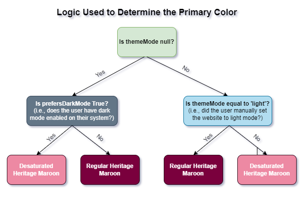

# Dark and Light Mode

A responsive website should follow the theme preference set by the user on their operating system (OS) or web browser while still allowing them to change the mode manually. In this section, we will implement the dark/light mode functionality and we will learn how to leverage the `useMediaQuery` hook and the `prefers-color-scheme` media query to enable dark mode automatically by checking the user's preference in their OS or browser settings.

## Modify `theme.ts`
We had previously set the primary and secondary colors of our theme in the `config/theme.ts` file. However, when using dark mode in our website, we will need to desaturate these colors to maintain a satisfactory level of contrast between the elements on screen and improve readability. Therefore, we will need to remove the primary and secondary color definitions from `theme.ts` since these values will now be set programmatically depending on the theme mode used.

**Delete** the following lines from `theme.ts`:
```ts
palette: {
    primary: {
        main: "#7a003c"
    },
    secondary: {
        main: "#fdbf57"
    }
},
```


## Determine Desaturated Theme Colors
We will use the [MUI Color Palette Tool](https://m2.material.io/inline-tools/color/) to determine the desaturated variant of our theme colors.


Colors in the `[200,50]` range can be used in dark mode.
For our theme, the desaturated primary color is `#ed89a3`, and the desaturated secondary color is `#fdd287`.

## Update the `Provider` Component
We will need to update the custom theme provider component to handle switching the theme in our SPA.

Open the `Provider/Provider.tsx` file  inside the `components` directory. Add the following import statement to it:
```ts
import useMediaQuery from '@mui/material/useMediaQuery'
```

Create and export the `ColorModeContext` constant, which will allow us to read and modify the theme mode of our website from the navigation bar. The following code should be added before the `Provider` function declaration:
```ts
// exporting the ColorModeContext containing the skeleton of the function used to change
// the current color mode
export const ColorModeContext = React.createContext({
    toggleColorMode: () => {},
})
```

Next, we will determine if the user currently has dark mode enabled on their system by reading the value of the  `prefers-color-scheme` media query. We will also use the React state hook to create a `themeMode` constant with a `null` initial value and a `setThemeMode` function that is used to update the `mode` constant.

Add the following lines of the code at the top of the `Provider` function:
```ts
// checking if the user has dark mode enabled on their system
const prefersDarkMode = useMediaQuery('(prefers-color-scheme: dark)')

// declaring the themeMode constant and the setTheMode function  
// themeMode can be "light", "dark" or null and is initialized to null
const [themeMode, setThemeMode] = React.useState<'light' | 'dark' | null>(null)
```

Define the primary and secondary colors and replace the `const theme` declaration with the following updated declaration:
```ts
// setting the primary color hex code depending on the themeMode
const primary_color = themeMode == null
        ? prefersDarkMode
            ? '#ed89a3'
            : '#7a003c'
        : themeMode == 'light'
            ? '#7a003c'
            : '#ed89a3';

// setting the secondary color hex code depending on the themeMode
const secondary_color = themeMode == null
	? prefersDarkMode
		? '#fdd287'
		: '#fdbf57'
	: themeMode == 'light'
		? '#fdbf57'
		: '#fdd287';

// creating a theme using the themeOptions imported from theme.ts
const theme = React.useMemo(
        () =>
            createTheme({
                ...themeOptions,
                palette: {
                    mode:
                        themeMode == null
                            ? prefersDarkMode
                                ? 'dark'
                                : 'light'
                            : themeMode,
                    primary: {
                        main: primary_color
                    },
                    secondary: {
                        main: secondary_color
                    },
                },
            }),
        [themeMode, prefersDarkMode, primary_color, secondary_color]
    )
```
This updated declaration utilizes the React `useMemo` hook to create and cache the theme value. The value of the `mode` attribute is determined by examining the the value of the `themeMode` constant we created earlier. The diagram below explains the conditional logic used to determine the value of `mode`:


When using dark mode, the primary and secondary colors of our theme are desaturated to retain readability and enhance contrast. The values of these colors are now determined programmatically as shown in the diagrams below:



We will now make use of the React `useMemo` hook to calculate and cache the value of the `colorMode` constant. Add the following lines of code **after** the `theme` declaration:
```ts
// the toggleColorMode function changes the themeMode depending on its current value
// if the current themeMode is light, it will change it to dark
// if the current themeMode is dark, it will change it to light
const colorMode = React.useMemo(
	() => ({
		toggleColorMode: () => {
			setThemeMode(prevMode => (prevMode == null ? (theme.palette.mode === 'dark' ? 'light' : 'dark') : prevMode === 'light' ? 'dark' : 'light'))
		},
	}),
	[theme]
)
```

Finally, wrap the returned elements of the `Provider` function with the `ColorModeContext.Provider`:
```ts
// we use the ColorModeContext.Provider to pass the current colorMode to all the component below it  
// we use the ThemeProvider to pass the current theme to all the component below it  
// any component can read the colorMode and theme, no matter how deep it is
return (
	<ColorModeContext.Provider value={colorMode}>
		<ThemeProvider theme={theme}>
			{children}
		</ThemeProvider>
	</ColorModeContext.Provider>
)
```
Your `Provider/Provider.tsx` file should now look like this:
```ts
'use client';  
  
import useMediaQuery from "@mui/material/useMediaQuery";  
import React from "react";  
import {createTheme, ThemeProvider} from '@mui/material/styles'  
import themeOptions from "@/config/theme";  
  
// exporting the ColorModeContext containing the skeleton of the function used to change  
// the current color mode  
export const ColorModeContext = React.createContext({  
    toggleColorMode: () => {},  
})  
  
export function Provider({ children } : {children: React.ReactNode}) {  
    // checking if the user has dark mode enabled on their system  
    const prefersDarkMode = useMediaQuery('(prefers-color-scheme: dark)')  
  
    // declaring the themeMode constant and the setTheMode function  
    // themeMode can be "light", "dark" or null and is initialized to null    
    const [themeMode, setThemeMode] = React.useState<'light' | 'dark' | null>(null)  
  
    // setting the primary color hex code depending on the themeMode  
    const primary_color = themeMode == null  
        ? prefersDarkMode  
            ? '#ed89a3'  
            : '#7a003c'  
        : themeMode == 'light'  
            ? '#7a003c'  
            : '#ed89a3';  
  
    // setting the secondary color hex code depending on the themeMode  
    const secondary_color = themeMode == null  
        ? prefersDarkMode  
            ? '#fdd287'  
            : '#fdbf57'  
        : themeMode == 'light'  
            ? '#fdbf57'  
            : '#fdd287';  
  
    // creating a theme using the themeOptions imported from theme.ts  
    const theme = React.useMemo(  
        () =>  
            createTheme({  
                ...themeOptions,  
                palette: {  
                    mode:  
                        themeMode == null  
                            ? prefersDarkMode  
                                ? 'dark'  
                                : 'light'  
                            : themeMode,  
                    primary: {  
                        main: primary_color  
                    },  
                    secondary: {  
                        main: secondary_color  
                    },  
                },  
            }),  
        [themeMode, prefersDarkMode, primary_color, secondary_color]  
    )  
  
    // the toggleColorMode function changes the themeMode depending on its current value  
    // if the current themeMode is light, it will change it to dark    
    // if the current themeMode is dark, it will change it to light    
    const colorMode = React.useMemo(  
        () => ({  
            toggleColorMode: () => {  
                setThemeMode(prevMode => (prevMode == null ? (theme.palette.mode === 'dark' ? 'light' : 'dark') : prevMode === 'light' ? 'dark' : 'light'))  
            },  
        }),  
        [theme]  
    )  
  
	// we use the ColorModeContext.Provider to pass the current colorMode to all the component below it  
	// we use the ThemeProvider to pass the current theme to all the component below it 
	// any component can read the colorMode and theme, no matter how deep it is
    return (  
        <ColorModeContext.Provider value={colorMode}>  
            <ThemeProvider theme={theme}>  
                {children}  
            </ThemeProvider>  
        </ColorModeContext.Provider>  
    )  
}
```

## Update `Navbar.tsx`

Open the `components/Navbar/Navbar.tsx` file and add the following import statement:
```ts
import {ColorModeContext} from "@/components/Provider/Provider";
```

Next, we will use the `useContext` hook to grab the current context value of the `ColorModeContext` imported from `components/Provider/Provider.tsx`.

Add the following line after the `theme` constant declaration in the `Navbar` function:
```ts
// reading the value of the ColorModeContext imported from Provider
const colorMode = React.useContext(ColorModeContext)
```

Add the `onClick` prop to the dark/light mode toggle in the navigation bar as shown below:
```ts

<MacIconNavButton
	sx={{ml: 1}}
	color="inherit"
	onClick={colorMode.toggleColorMode}
>
	{theme.palette.mode === 'dark' ? (
		<Brightness7Icon />
	) : (
		<Brightness4Icon />
	)}
</MacIconNavButton>

```

Go back to your browser and try switching mode by using the sundial icon in the navigation bar.


The official MUI guidelines recommend reducing the use of brand colors in dark mode. As such, we opted for a gray navigation bar in dark mode. 


The chosen mode is automatically applied to all pages of the website. Try navigating to "Page1", "Page 1", "Page 2" and the "Settings" page. They will all automatically use the chosen mode and the text and UI element colors will change to maintain readability.


Try enabling dark mode on your system and then navigate to the website in a new tab or reload the current tab. The website should automatically use dark mode when you first load the page. Note that you can still manually switch to light mode using the sundial icon.