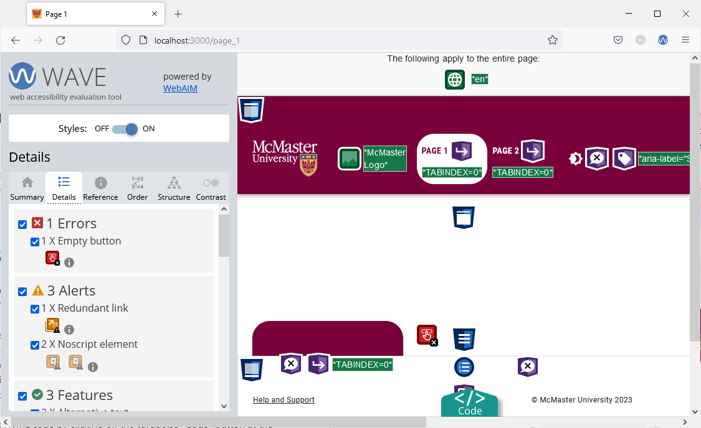
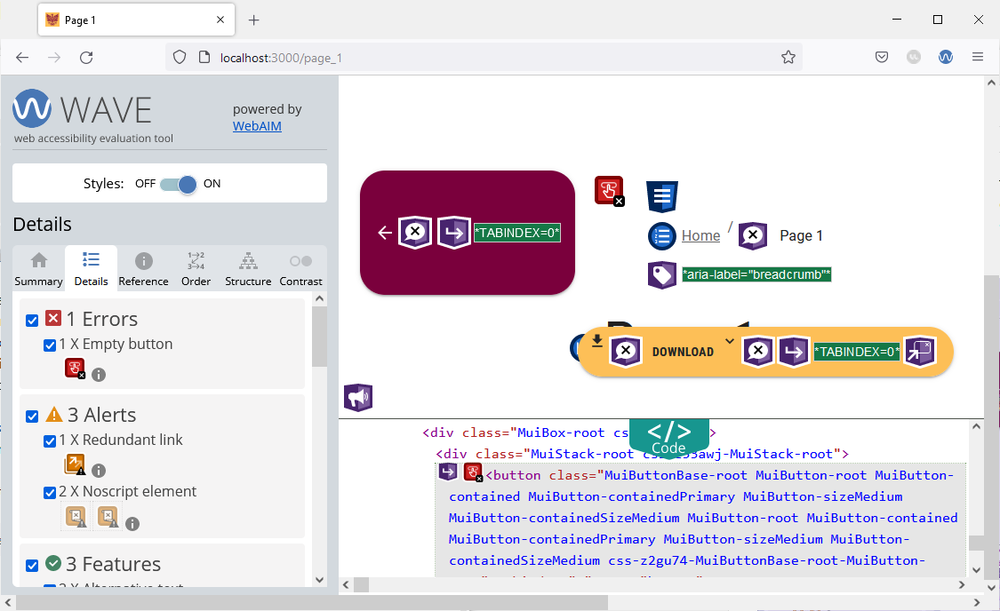
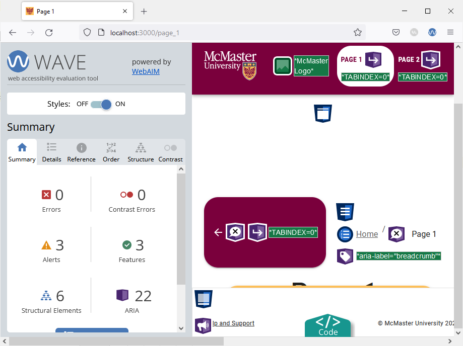
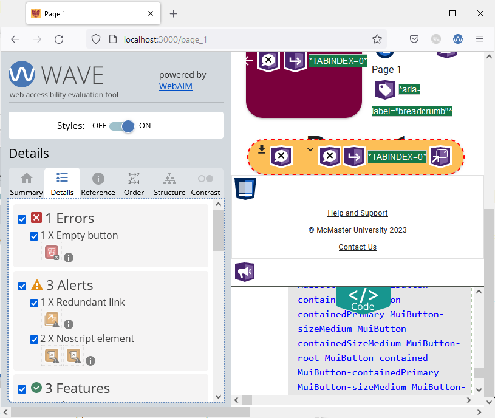
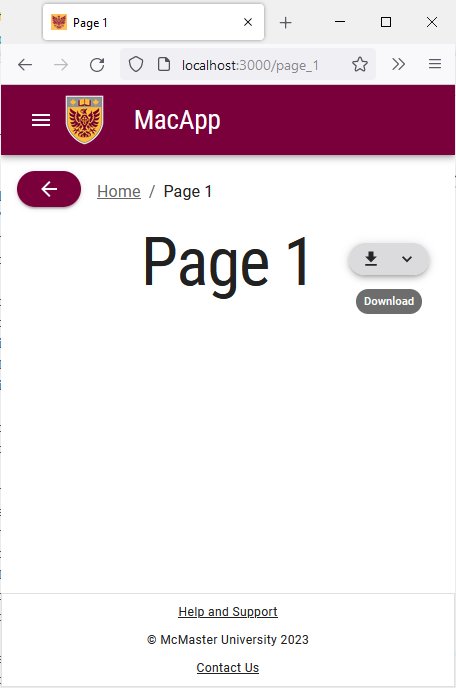
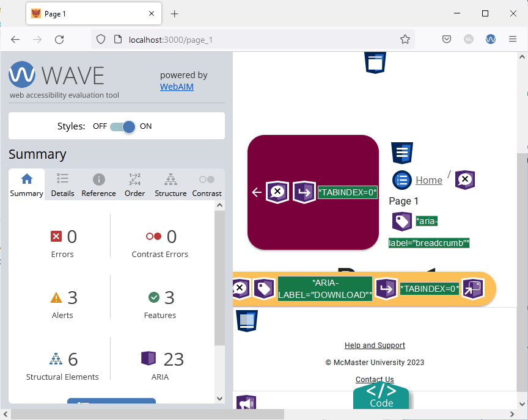

# Empty Button Error

Navigate to "Page 1" (using the medium/large screen UI) and run the Wave tool. The tool will identify 1 error.



Open the "Details" tab in the Wave sidebar to find more details regarding the errors and alerts. We can now see that the error is caused by an empty button, i.e., a button without any text or tooltip message. Screen readers cannot properly process empty buttons, so we will need to address this issue to ensure that our website meets the accessibility standards.

Pull the website's HTML code by clicking on the turquoise "Code" button at the bottom of the screen. With the code view pulled up, click on the red button under "1 X Empty button" and you will redirected to the HTML code section that corresponds to the empty button. 



After inspecting the code, we found that the empty button is the "Back" button that appears next to the breadcrumbs. To fix this error, we will add a `title` prop to the `MacButton` component used to render the "Back" button.

Open the `components/BreadCrumbs/BreadCrumbs.tsx` file and locate the `MacButton` component containing an `ArrowBackIcon`. Add a `title` prop to the `MacButton` component:
```
<MacButton variant="contained" mainColor="primary" onClick={() => router.back()} title={"Back"}>
    <ArrowBackIcon />
</MacButton>
```

Go back to your browser and try hovering over the back button. You will see a the title message appear.
Re-run the Wave tool on "Page 1". The empty button error will no longer be shown.



Shrink your browser window to trigger the mobile version of "Page 1" and run the Wave tool. You will find that the page has another empty button error caused by the shrunken "Download" button that no longer has text in it. 



While we can use a title message to resolve this issue like we did for the back button, we will show another way of addressing the problem.

Open the `pages/page_1/index.tsx` file and add the following import statement:
```
import Tooltip from "@mui/material/Tooltip";
```

Locate the `MacButton` "Download" component and wrap it in a `Tooltip` component as shown below:
```

 <Tooltip title={useMediaQuery(useTheme().breakpoints.down('md')) ? 'Download' : ''} >
	<MacButton
		id="download-button"
		sx={{
			position: 'fixed',
			top: 20,
			right: 10,
			zIndex: 2000,
			display: 'flex'
		}}
		aria-controls={
			openMenu ? 'download-menu' : undefined
		}
		aria-haspopup="true"
		aria-expanded={openMenu ? 'true' : undefined}
		variant="contained"
		onClick={handleClickMenu}
		startIcon={<DownloadIcon />}
		endIcon={<KeyboardArrowDownIcon />}
		mainColor="secondary"
>
		{useMediaQuery(useTheme().breakpoints.up('md')) ? 'Download' : ''}
	</MacButton>
</Tooltip>

```
The tooltip message will only be displayed on the small variant of the "Download" button since we use breakpoints to conditionally set the tooltip title. 



Reload the page and re-run the Wave tool. The error should now be fixed because tooltip messages can be read by screen readers.

