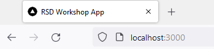
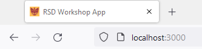

# Update the Favicon

Changing the default favicon of a Next.js application is one of the first things you can do when branding your website.

The demo app includes two favicons: the default Next.js one (`public/favicon2.ico`) and the McMaster favicon (`public/favicon.ico`), which was downloaded from [McMaster University Brand Standards Website Favicon Folder](https://brand-resources.mcmaster.ca/asset-bank/action/browseItems?categoryId=1516&categoryTypeId=2&cachedCriteria=1).

To change the favicon of your SPA, open the `pages/index.tsx` file and modify the `Head` component by changing the `href` prop to `/favicon.ico` as shown below:

```
<Head>
	<title>RSD Workshop App</title>
	<meta name="description" content="Generated by create next app" />
	<meta name="viewport" content="width=device-width, initial-scale=1" />
	<link rel="icon" href="/favicon.ico" />
</Head>
```

Default Favicon          |  McMaster Favicon
:-------------------------:|:-------------------------:
  |  