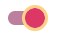
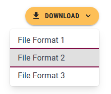

# Accessible Focus Indicators

Accounting for keyboard users is an imperative step towards ensuring that all users can easily navigate your website's user interface. A keyboard user’s cursor equivalent is called a **focus indicator**. Unfortunately, not all websites feature accessible focus indicators. By designing and implementing accessible focus indicators, we can make our website more accessible to keyboard users and users of assistive technology.

According to the [Web Content Accessibility Guidelines (WCAG)](https://www.w3.org/WAI/WCAG22/Understanding/focus-appearance-minimum), a focus indicator should satisfy the following requirements:
- The focus indicator should the visual presentation of the user interface component;
- The focus indicator should have a contrast ratio of at least 3:1 between its pixels in the focused and unfocused states;
- The focus indicator should have a contrast ratio of at least 3:1 against adjacent colors **or** should not be thinner than 2px.

By default, MUI uses a pulsing ripple effect when tabbing through UI elements. The pulsing ripple does not meet the accessibility requirements. In this section of the workshop, we will learn how to style the focus indicator of a number of MUI components to ensure that it meets the requirements outlined by the WCAG.

## Navigation Buttons
We will start updating the custom buttons we created for the navigation bar to ensure that that they have accessible focus indicators.

Open the `MacNavButton.tsx` file located under the `components/MacComponents` directory and the following lines of code under **both** the `MacNavButton` and `MacIconNavButton` declarations:
```ts
"&:focus-visible": {
	outline: "2px solid #fff",
},
```

We defined the `focus-visible` pseud-class to be a solid white outline that is `2px` thick.

Save the file and go back to your browser. Try to tab through the navigation bar and notice the updated focus indicator.

Accessible Focus Indictor on `MacNavButton`          |  Accessible Focus Indicator on `MacIconNavButton`
:-------------------------:|:-------------------------:
  |  

## Buttons
We will now update the custom `MacButton` component that we created earlier with an accessible focus indicator.

Open the `MacButton.tsx` file located under the `components/MacComponents` directory and the following lines of code under `MacButton` declarations
```ts
"&:focus-visible": {
	color: useTheme().palette.mode === 'dark' ? (props.mainColor === 'primary' ? '#FFFFFF' : '') : '',
	backgroundColor:
		props.mainColor === 'secondary' ? '#DBDBDD' : '#5E6A71',
	outline: `2px solid ${useTheme().palette.mode === 'dark' ? (props.mainColor === 'primary' ? '#F4B7C7' : '#dd3765') : (props.mainColor === 'primary' ? 'black' : useTheme().palette.primary.main) }`,
},
```

We determine the color of the focus indicator depending on the current theme (light/dark) and whether the button is a primary or secondary button. The chosen color of the outline has a contrast ratio that is equal to or greater than 3:1 with neighboring colors.


Focus Indictor on Primary `MacButton`          |  Focus Indicator on Secondary `MacButton`
:-------------------------:|:-------------------------:
   |    

## Switches 
We will start by adding a regular `Switch` component to "Page 1" to inspect the default focus indicator.

Open the `app/page_1/page.tsx` file and add the following import statement: 
```ts
import {Switch} from "@mui/material";
```

Next, add the following lines after the `</Box>` closing tag:
```ts
<Box paddingLeft={5}>  
    <Switch {...{ inputProps: { 'aria-label': 'Switch' } }} />  
</Box>
```

Go back to your browser and try to tab through the switch component and notice how hard it is to see the focus indicator against a white background.


We will now create a custom `MacSwitch` component that has an accessible focus indicator.

Create a new `MacSwitch.tsx` file under the `components/MacComponents` directory and add the following lines of code to it:

```ts
import styled from "@emotion/styled";
import Switch, {SwitchProps} from "@mui/material/Switch";
import React from "react";

export const MacSwitch = styled((props: SwitchProps) => (
    <Switch disableFocusRipple {...props} />
))(({ }) => ({
    '& .MuiSwitch-switchBase': {
        '&.Mui-focusVisible .MuiSwitch-thumb': {
            backgroundColor: '#5E6A71',
            outline: `3px solid #F4B7C7`,
        },
    },
    '& .MuiSwitch-switchBase.Mui-checked': {
        '&.Mui-focusVisible .MuiSwitch-thumb': {
            backgroundColor: '#dd3765',
            outline: '3px solid #fdd287',
        },
    }
}));
```

We disabled the default ripple focus indicator and replaced it with a solid outline that changes color depending on whether the switch is enabled or not. We also change the color of the switch thumb when it is in focus for emphasis. 

Go back to the `page_1/page.tsx` file and replace the `Switch` import statement with the following import statement:
```ts
import {MacSwitch} from "@/components/MacComponents/MacSwitch";
```

Replace the `Switch` component with a `MacSwitch` component:
```ts
<Box paddingLeft={5}>  
    <MacSwitch {...{ inputProps: { 'aria-label': 'Switch' } }} />  
</Box>
```

Go back to your browser and try tab over the new `MacSwitch`:

Focus Indictor on Enabled `MacSwitch`          |  Focus Indicator on Disabled `MacSwitch`
:-------------------------:|:-------------------------:
  |  
## Checkboxes
We will now add a regular `CheckBox` component to "Page 1" to inspect the default focus indicator.

Open the `app/page_1/page.tsx` file and add the following import statement: 
```ts
import {Checkbox} from "@mui/material";
```

Next, add the following line inside the `Box` component containing the `MacSwitch`:
```ts
<Box paddingLeft={5}>  
	<MacSwitch {...{ inputProps: { 'aria-label': 'Switch' } }} />
	<Checkbox {...{ inputProps: { 'aria-label': 'Checkbox' } }} />    
</Box>
```

Go back to your browser and try to tab through the checkbox component and notice how hard it is to see the focus indicator against a white background.


We will now create a custom `MacCheckbox` component that has an accessible focus indicator.

Create a new `MacCheckbox.tsx` file under the `components/MacComponents` directory and add the following lines of code to it:

```ts
import styled from "@emotion/styled";  
import Checkbox, {CheckboxProps} from "@mui/material/Checkbox";  
import React from "react";  
import {useTheme} from "@mui/material/styles";  
  
export const MacCheckbox = styled((props: CheckboxProps) => (  
    <Checkbox disableFocusRipple {...props} />  
))(({ }) => ({  
    '&.Mui-focusVisible': {  
        outline: `2px solid ${useTheme().palette.primary.main}`,  
    },  
}));
```

We disabled the default ripple focus indicator and replaced it with a solid outline that uses the primary color of our theme. 

Go back to the `page_1/page.tsx` file and replace the `Checkbox` import statement with the following import statement:
```ts
import {MacCheckbox} from "@/components/MacComponents/MacCheckbox";
```

Replace the `Checkbox` component with a `MacCheckbox` component:
```ts
<Box paddingLeft={5}>  
    <MacSwitch {...{ inputProps: { 'aria-label': 'Switch' } }} />  
    <MacCheckbox {...{ inputProps: { 'aria-label': 'Checkbox' } }} />  
</Box>
```

Go back to your browser and try tab over the new `MacSwitch`:

Focus Indictor on `MacCheckbox` in Light Mode          |  Focus Indicator on `MacCheckbox` in Dark Mode
:-------------------------:|:-------------------------:
  |  

## Remaining MUI `ButtonBase` Components

MUI uses the `ButtonBase` for many of its  clickable components like options in a dropdown menu, action areas, icon buttons, etc.

Adding an accessible focus indicator to the `ButtonBase` class will ensure that the vast majority of clickable components in our SPA can be easily navigated using the keyboard.

Open the `Provider/Provider.tsx` file and update the `theme` constant declaration as shown below:
```ts
const theme = React.useMemo(  
    () =>  
        createTheme({  
            ...themeOptions,  
            palette: {  
                mode:  
                    themeMode == null  
                        ? prefersDarkMode  
                            ? 'dark'  
                            : 'light'  
                        : themeMode,  
                primary: {  
                    main: primary_color  
                },  
                secondary: {  
                    main: secondary_color  
                },  
            },  
            components: {  
                ...themeOptions.components,  
                MuiButtonBase: {  
                    styleOverrides: {  
                        root: {  
                            "&:focus-visible": {  
                                outline: `2px solid ${primary_color}`,  
                            },  
                        },  
                    },  
                }  
            }  
        }),  
    [themeMode, prefersDarkMode]  
)
```

We added a focus indicator that uses the primary color of our theme to the `MuiButtonBase` component.

Save the file and then try to tab through the options in the "Download" button dropdown menu on "Page 1":


If your website uses additional MUI components that were not covered, it is important to ensure that all of them have accessible focus indicators that mimic the ones shown in this workshop.