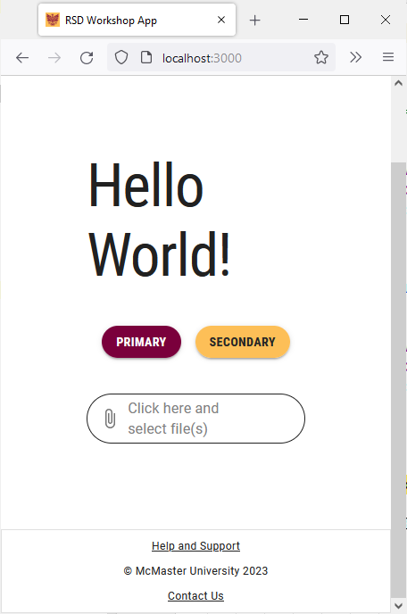

# Footer

A website's footer typically contains copyright notices, disclaimers, and links to a support page, contact form or social media accounts. Keeping the footer pinned at the bottom of the screen regardless of the user's current position on the page may be desirable on large displays. However, on small screens the footer should only be visible when the user scrolls to the bottom of the page. In this section, we will learn how to modify a footer's position depending on the screen size.

## Modify the Footer Position
Open the `components/Footer/Footer.tsx` file and locate the `Paper` component inside the `return` statement. 
Notice that the `position` prop is set to `fixed` , which is why the footer is always visible at the bottom of the page. We will modify this prop to be set conditionally depending on the screen size using the MUI breakpoints API. 

Add the following import statement to `Footer.tsx`:
```
import {useTheme} from "@mui/material/styles";
```

Delete the `position: 'fixed'` line and replace it with the following lines of code:
```
[useTheme().breakpoints.between('xs', 'md')]: {
	position: 'relative',
},
[useTheme().breakpoints.up('md')]: {
	position: 'fixed',
},
```
We set the footer `position` to `relative` on screen size between small (inclusive) and medium (non-inclusive), whereas the position is set to `fixed` on screens that are medium or larger. 

## Modify the Footer Height
Similarly, we will need to reduce the height of the footer on small screens by adding the following lines of code inside the `sx` prop:
```
[useTheme().breakpoints.between('xs', 'md')]: {  
	height: '93',  
},
```

Try shrinking your browser window and notice how the footer will automatically be moved to the bottom when the browser window is small enough. 

## Modify the Footer Content Placement
The copyright information and the links are not positioned properly on small screens since there isn't enough horizontal space. We will limit the current footer layout to medium and large displays and use a `Stack` component to position the copyright information and links vertically on small screens. 

Replace the `display: 'flex'` line inside the `sx` prop of the `Box` and the first two `Grid` components with `display: {xs: 'none', md: 'flex'}` as shown below:

```

<Box
	sx={{
		flexGrow: 1,
		justifyContent: 'center',
		display: {xs: 'none', md: 'flex'},
		my: 1,
	}}
></Box>
<Grid item xs={12} sm={6} md={3} sx={{display: {xs: 'none', md: 'flex'}}}></Grid>
<Grid
	sx={{
		flexGrow: 1,
		justifyContent: 'space-between',
		display: {xs: 'none', md: 'flex'}
	}}
	container
	spacing={2}


```

Add the following import statement to `Footer.tsx`:
```
import Stack from "@mui/material/Stack";
```

Add the following lines of code to before the closing `</Container>` tag:
```

<Stack
	direction="column"
	justifyContent="space-between"
	alignItems="center"
	spacing={1}
	sx={{display: {xs: 'flex', md: 'none'}}}
>
	<Box
		sx={{
			flexGrow: 1,
			justifyContent: 'flex-start',
			display: 'flex',
			alignItems: 'flex-start',
			mt: 1
		}}
>
		<Typography
			component={Link}
			href="/support"
			variant="caption"
			color="inherit"
>
			Help and Support
		</Typography>
	</Box>

	<Box
		sx={{
			flexGrow: 1,
			justifyContent: 'center',
			display: 'flex',
		}}
>
		<Typography variant="caption" color="inherit">
			© McMaster University {new Date().getFullYear()}
		</Typography>
	</Box>

	<Box
		sx={{
			flexGrow: 1,
			justifyContent: 'flex-end',
			display: 'flex',
			alignItems: 'flex-end',
		}}
>
		<Typography
			component={Link}
			href="mailto: example@mcmaster.ca"
			variant="caption"
			color="inherit"
			sx={{mb: 1}}
>
			Contact Us
		</Typography>
	</Box>
</Stack>

```

Save the file and go back to your browser. Try changing the browser window width and notice how the footer changes.

