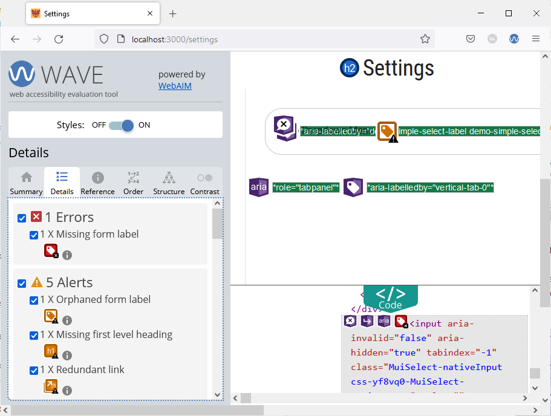

# Missing Form Label Error

Navigate to the "Settings" page by clicking on the gear icon and evaluate the page using the WAVE tool. The "Details" tab of the WAVE tool shows a missing form label error.



This error is caused by the dropdown menu component (i.e., the `Select` component) not having an `id` that matches the corresponding `InputLabel`. To fix this issue, simply open the `components/TabPanel/VerticalTabs.tsx` file and locate the `InputLabel` and `Select` components.

Add an `htmlFor` prop to the `InputLabel` component as shown below:
```ts
{/* the value of htmlFor should match the id of the Select component */}
<InputLabel id="demo-simple-select-label" htmlFor="demo-simple-select-input">
	Demo Dropdown Menu
</InputLabel>
```

Next, we will add an `id` to the `Select` component using `inputProps`. The `id` of the `Select` component has to match the one entered in the `htmlFor` field of the `InputLabel`:
```ts

<Select
	labelId="demo-simple-select-label"
	id="demo-simple-select"
	label="Demo Dropdown Menu"
	inputProps={{
		id:'demo-simple-select-input',
	}}
>
	<MenuItem value={1}>Option 1</MenuItem>
	<MenuItem value={2}>Option 2</MenuItem>
	<MenuItem value={3}>Option 3</MenuItem>
</Select>

```

Reload the "Settings" page in your browser and re-run the WAVE tool. The missing form label error should now be fixed.
