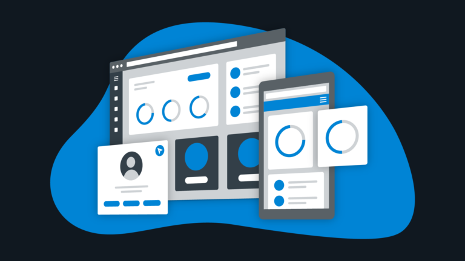

# Building Modern JavaScript Websites

_Image retrieved from [tillerdigital.com]([7 challenges in web application design and development | Tiller Digital](https://tillerdigital.com/blog/7-challenges-in-web-application-development/))_

In this beginner workshop, we will take a deep dive into the process of designing and building responsive JavaScript websites. We will explore the different ways you can style your web applications to adhere to a consistent theme that is reflected throughout the user interface. We will add support for light and dark mode in our web application to give users the flexibility of choosing the viewing experience that best suits their preferences and light conditions. We will learn how to style visual components and modify their behavior to ensure that they react to the user's actions in an intuitive matter. We will also explore the various design patterns that you can adopt to ensure that your web application scales appropriately on mobile devices with small screens without any loss of functionality. Finally, we will learn how to evaluate a web page to ensure that it meets the standards required by the Accessibility for Ontarians with Disabilities Act  (AODA). 

This workshop uses the Next.js framework in conjunction with the Material UI (MUI) library. If you are using a different tech stack or framework that the ones in this workshop, please feel free to book a consultation with the Research Software Development team by emailing [rsd@mcmaster.ca](mailto:rsd@mcmaster.ca). No previous experience with Next.js or MUI is required. Familiarity with TypeScript and React will be helpful but is not necessary.

## Prerequisites
- **Git**: We will be using Git to clone a repository from GitHub. Git should be installed on your local machine to clone the workshop web application repository. Please consult the following [guide](https://github.com/git-guides/install-git) if you need help installing git on your machine.
- **IDE (Integrated Development Environment)**: You will need to have an IDE installed on your computer to easily modify the workshop web application code and files. We recommend using [Visual Studio Code](https://code.visualstudio.com/) or [WebStorm](https://www.jetbrains.com/webstorm/).
- **Node.js**: We will be using Node.js in this workshop to install packages and run the web application locally on our machine. Please consult the [Pre-workshop Material](pre-workshop) section if you need help installing Node.js on your machine. 

