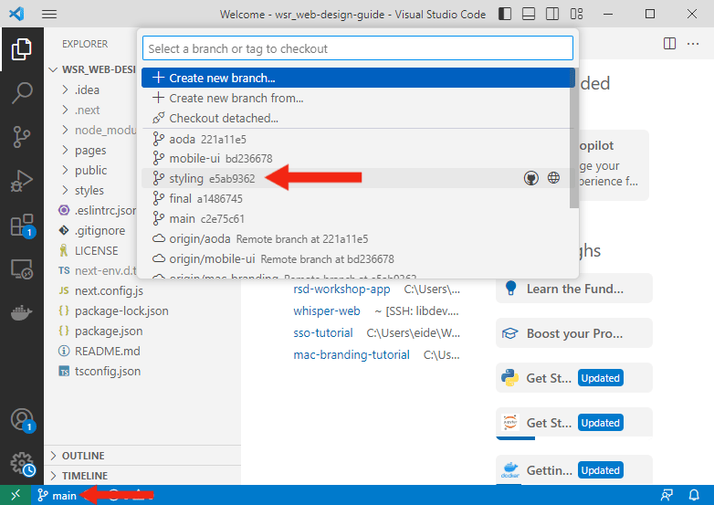

# Design Guidelines for McMaster Websites

The [McMaster Digital Brand Standards](https://brand.mcmaster.ca/app/uploads/2019/04/digital-guidelines.pdf) PDF document provides a good overview of the brand guidelines designed to ensure recognition of the McMaster University brand and consistency of its message. The design guidelines presented in this workshop were pulled from this PDF document and modified to apply to Material UI (MUI) components.

_Image retrieved from [itnext.io](https://itnext.io/next-js-with-material-ui-7a7f6485f671)_

In this beginner workshop, participants will learn how to style Material UI (MUI) components in a Next.js single-page application (SPA) to fit the McMaster Digital Brand Standards. We will also learn how to scale the user interface for mobile devices and ensure that our web application is AODA compliant using the Wave tool.

No previous experience with Next.js or MUI is required. Familiarity with TypeScript and React will be helpful but is not necessary.

## Prerequisites
- **Git**: Git should be installed on your local machine to clone the workshop single-page application repository. Please consult the following [guide](https://github.com/git-guides/install-git) if you need help installing git on your machine.
- **IDE (Integrated Development Environment)**: You will need to have an IDE installed on your computer to easily modify the workshop SPA files. We recommend using [Visual Studio Code](https://code.visualstudio.com/) or [WebStorm](https://www.jetbrains.com/webstorm/).

## Pre-workshop Setup

Please follow these steps to install Node.js and create a Next.js application **before** starting the workshop.

If you are using Windows or MacOS, use one of the installers from the [Node.js download page](https://nodejs.org/en/download/). Be sure to install the version labeled **LTS**. Other versions have not yet been tested with `npm`.

If you are using a Linux distribution, you can install Node.js using the `apt` package manager.
1. Start by refreshing your local package index: 
~~~
sudo apt update
~~~
2. Install Node.js: 
~~~
sudo apt install nodejs
~~~
3. Verify that the installation was successful: 
~~~
node -v
~~~
  You should be presented with the version of Node.js that you just installed.
4. Install the `npm` package manager:
~~~
sudo apt install npm
~~~

### Clone the Next.js Workshop SPA
Once you have Node.js installed, you can clone the demo SPA used in this workshop by opening a terminal window and running the following command:
```git clone https://github.com/McMasterRS/wsr_web-design-guide.git```

You will now have an `wsr_web-design-guide` repo on your local machine.

### Start the Development Server
1. `cd` into the your project directory: 
~~~
cd wsr_web-design-guide
~~~

2. Checkout the `mac-branding` branch using the following command:
```
git checkout mac-branding
```
Alternatively, you can switch branches using your IDE's GUI:

_Checking out  the `mac_branding` branch using Visual Studio Code_


_Checking out  the `mac_branding` branch using WebStorm_

3. Install `next` using the following command:
```
npm i next
```

4. Start the development server:
~~~
npm run dev
~~~

### View the the Single-Page Application
Open your browser of choice and navigate to: `localhost:3000`
You should be presented with the following page:

