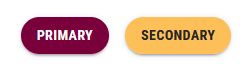
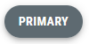
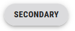
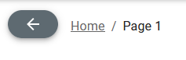
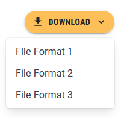
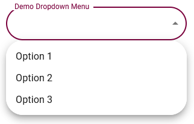
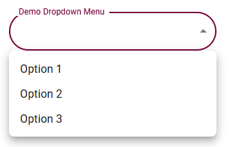

# Interactive UI Elements

Modern websites require the use of UI elements that not only allow the user to perform a wide range of functions, but also react to the user's actions in an intuitive manner. In this section, we will learn how to style certain MUI components to conform to the stylistic guidelines set by McMaster Digital Brand Standards Manual.

## Buttons

### Create a Styled `MacButton` Component
We will start by creating a styled `MacButton` component based on the standard `MuiButton` button. We will add a `mainColor` prop to the `MacButton` component that will determine the background color, text color and hover color of the button. If the `mainColor` prop is `'primary'`, then the background color will be Heritage Maroon, the text color will be white and the button will turn a medium shade of grey when the user hovers over it as required by the McMaster Digital Brand Standards guide. On the other hand, if the `mainColor` prop is `'secondary'`, then the background color will be Heritage Gold, the text color will be dark grey and the button will turn light grey when the user hovers the mouse over it.

Create a `MacButton.tsx` file in the `components/MacComponents` directory and add the following lines of code to it:
```ts
import {useTheme} from '@mui/material/styles'
import styled from '@emotion/styled'
import MuiButton, {ButtonProps} from '@mui/material/Button'

// extending the ButtonProps with a mainColor prop of type string
interface MacButtonProps extends ButtonProps {
    mainColor: string
}

export const MacButton = styled(MuiButton, {shouldForwardProp: (prop) => prop !== "mainColor"})<MacButtonProps>(props => ({
    // if mainColor is secondary, the button background color should be heritage gold (i.e., the secondary color in our theme)
    // otherwise, the button background color should be heritage maroon (i.e., the primary color in our theme)
    backgroundColor: props.mainColor === 'secondary' ? useTheme().palette.secondary.main:  useTheme().palette.primary.main,
    // if mainColor is secondary, the button text color should be dark gray
    // otherwise, the button text color should be white
    color: props.mainColor === 'secondary' ? '#262626':  '',
    
    // setting the hover behavior of MacButton
    ':hover': {
        // if mainColor is secondary, the button should turn light gray (#DBDBDD) when hovering over it
        // otherwise, the button should turn dark gray (#5E6A71) when hovering over it
        backgroundColor: props.mainColor === 'secondary' ? '#DBDBDD':'#5E6A71',
    },
}));
```

### Update the Buttons on the Main Page
We will now update the buttons on the main index page to use the newly created `MacButton` component instead of the standard MUI `Button` component. 

Open the `app/page.tsx` file and replace the `Button` import statement with following import statement:
```ts
import {MacButton} from '@/components/MacComponents/MacButton'
```

Locate the two `Button` components and modify them as shown below:
```ts
<MacButton 
	variant="contained" 
	mainColor="primary" 
	onClick={handleClick('Primary Button Clicked!')}
>
	Primary
</MacButton>
<MacButton 
	variant="contained" 
	mainColor="secondary" 
	onClick={handleClick('Secondary Button Clicked!')}
>
	Secondary
</MacButton>
```

Notice how we used the `mainColor` prop to determine the color of the button and its hover behavior.

Save the file and go back to your browser. The buttons on the main page should now look like this:




Try hovering over each button and notice how they change color.

Hovering Over Primary Button            |  Hovering Over Secondary Button
:-------------------------:|:-------------------------:
  |  

### Update the Back Button on the `BreadCrumbs` component
Open the `components/BreadCrumbs/BreadCrumbs.tsx` file and replace the `Button` import statement with following import statement:
```ts
import {MacButton} from '@/components/MacComponents/MacButton'
```

Locate the  `Button` component and modify it as shown below:
```ts
<MacButton variant="contained" mainColor="primary" onClick={() => router.back()}>
	<ArrowBackIcon />
</MacButton>
```

Save the file and navigate to "Page 1" in your browser. Try hovering over the back and notice how it turns grey.


## Buttons With a Dropdown Menu
The styled `MacButton` that we created earlier can be combined with a dropdown menu to create a button that allows the user to execute mutually exclusive functions that fall under the same category e.g., a download button that lets the user choose the file format. Our SPA already has a regular MUI `Button` with a dropdown menu on "Page 1". We will update the button to use the the `secondary` variant of the `MacButton` component.

Open `page_1/page.tsx` and replace the `Button` import statement with following import statement:
```ts
import {MacButton} from '@/components/MacComponents/MacButton'
```

 Locate the "Download" `Button` component and change it to use the  `MacButton` component as shown below:
```ts

<MacButton
	id="download-button"
	sx={{
		position: 'fixed',
		top: 20,
		right: 10,
		zIndex: 2000,
		display: 'flex'
	}}
	aria-controls={
		openMenu ? 'download-menu' : undefined
	}
	aria-haspopup="true"
	aria-expanded={openMenu ? 'true' : undefined}
	variant="contained"
	onClick={handleClickMenu}
	startIcon={<DownloadIcon />}
	endIcon={<KeyboardArrowDownIcon />}
	mainColor="secondary"
>
	Download
</MacButton>
s
```

The styled download button will look like this:



## Speed Dials

Material UI offers a `SpeedDial` component that allows developers to create a floating action button, which can display related actions. The `SpeedDial` component is often used to group action that manipulate the state of an object e.g., "edit", "delete", and "save". We will now learn how to create a styled `SpeedDial` component that adheres to the McMaster Branding Standards.

Create a `MacSpeedDial.tsx` file in the `components/MacComponents` directory and add the following lines of code to it:
```ts
import {useTheme} from '@mui/material/styles'
import styled from '@emotion/styled'
import SpeedDial, {SpeedDialProps} from '@mui/material/SpeedDial'

// extending the SpeedDialProps with a mainColor prop of type string
interface MacSpeedDialProps extends SpeedDialProps {
    mainColor: string
}

export const MacSpeedDial = styled(SpeedDial, {shouldForwardProp: (prop) => prop !== "mainColor"})<MacSpeedDialProps>(props => ({
    '& .MuiFab-primary': {
        // if mainColor is secondary, the speed dial background color should be heritage gold (i.e., the secondary color in our theme)
        // otherwise, the speed dial background color should be heritage maroon (i.e., the primary color in our theme)
        backgroundColor: props.open
            ? props.mainColor === 'secondary'
                ? '#DBDBDD'
                : '#5E6A71'
            : props.mainColor === 'secondary'
                ? useTheme().palette.secondary.main
                : useTheme().palette.primary.main,
        // if mainColor is secondary, the speed dial text color should be dark gray
        // otherwise, the speed dial text color should be white
        color: props.mainColor === 'secondary' ? '#262626' : '',

        // setting the hover behavior of MacSpeedDial
        '&:hover': {
            // if mainColor is secondary, the speed dial should turn light gray (#DBDBDD) when hovering over it
            // otherwise, the speed dial should turn dark gray (#5E6A71) when hovering over it
            backgroundColor:
                props.mainColor === 'secondary' ? '#DBDBDD' : '#5E6A71',
        },
    },
}))
```

We added a `mainColor` prop to the `MacSpeedDial` component that will determine the background color, text/icon color and hover color of the button. Akin to the `MacButton` component, if the `mainColor` prop is `'primary'`, then the background color will be Heritage Maroon, the text/icon color will be white and the speed dial will turn a medium shade of grey when the user hovers over it as required by the McMaster Digital Brand Standards guide. Otherwise, if the `mainColor` prop is `'secondary'`, then the background color will be Heritage Gold, the text/icon color will be dark grey and the button will turn light grey when the user hovers the mouse over it.

We will now use the `MacSpeedDial` component on "Page 2". Open the `app/page_2/page.tsx` file and add the following import statement:
```ts
import {MacSpeedDial} from '@/components/MacComponents/MacSpeedDial'  
```

You can remove `SpeedDial` from the following import statement `import {SpeedDial, SpeedDialAction, SpeedDialIcon} from "@mui/material";`

Replace the `SpeedDial` component with a `MacSpeedDial` component and add the `mainColor` prop as shown below:
```ts

<MacSpeedDial
	ariaLabel="Demo SpeedDial"
	sx={{
		position: 'fixed',
		top: 10,
		right: 10,
		zIndex: 2000,
	}}
	icon={<SpeedDialIcon />}
	onClose={handleCloseSD}
	onOpen={handleOpenSD}
	open={openSD}
	direction="down"
	mainColor="primary"
>
	{actions.map(action => (
		<SpeedDialAction
			key={action.name}
			icon={action.icon}
			tooltipTitle={action.name}
			onClick={action.action}
		/>
	))}
</MacSpeedDial>

```

Save the file and navigate to "Page 2" in your browser. The Speed Dial will now turn grey when you hover over it:


## Dropdown Menu
Dropdown menus allow the user to select an option from a given list. Material UI provides a `Select` component that can be used to generate dropdown menus. The "Settings" page of our SPA already has a dropdown menu with rounded corners (due to the `shape` property set in `theme.ts`). However, the list of options that appears when you click on the dropdown menu has rounded corners that could potentially clip text. We will need to reduce the border radius of the  `MuiPaper` component to address this concern.

Open `config/theme.ts` and add the following lines of code after the `shape` definition (make sure there is a comma after the `shape` definition):
```ts
components: {
	// overwriting the border radius for the MuiPaper component (used in dropdown menus)
	MuiPaper: {
		styleOverrides: {
			root: {
				borderRadius: 8,
			},
		},
	},
}
```

Original Dropdown Menu        |  Styled Dropdown Menu
:-------------------------:|:-------------------------:
  |  
