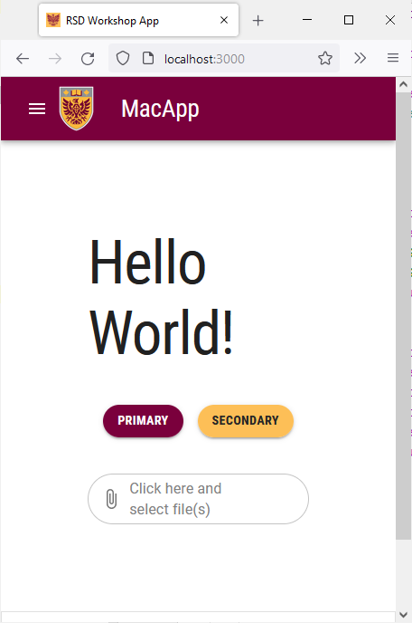
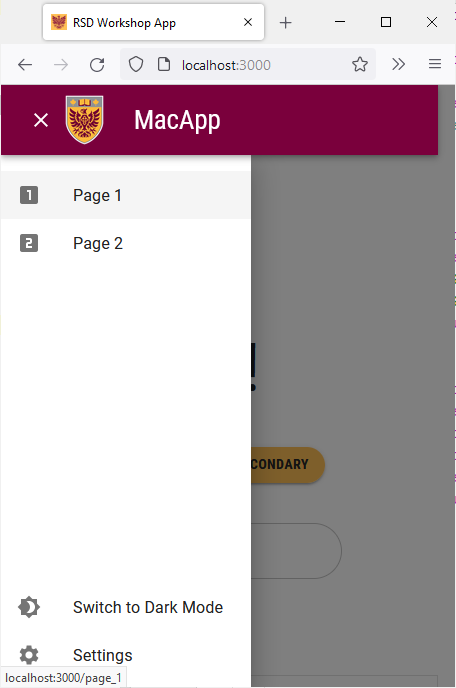

# Navigation Bar

We have already styled the navigation bar in our SPA. However, the current design does not scale properly on smaller displays. We will modify the navigation bar to make use of the MUI `Drawer` component on smaller screens.

## Limit Current Configuration to Medium/Large Displays
We will start by limiting the current navigation bar setup to medium and large display using breakpoints.

Open the `components/Navbar/Navbar.tsx` file and replace all the existing `display: 'flex'` lines with `display: {xs: 'none', md: 'flex'}`.

## Add a Drawer
Start by adding the following import statements to `Navbar.tsx`:
```
import Drawer from "@mui/material/Drawer";  
import List from "@mui/material/List";  
import ClearIcon from '@mui/icons-material/Clear';  
import ListItem from "@mui/material/ListItem";  
import ListItemButton from "@mui/material/ListItemButton";  
import ListItemIcon from "@mui/material/ListItemIcon";  
import ListItemText from "@mui/material/ListItemText";  
import LooksOneIcon from '@mui/icons-material/LooksOne';  
import LooksTwoIcon from '@mui/icons-material/LooksTwo';
import MenuIcon from '@mui/icons-material/Menu';
```

Next, add the following lines of code before the `return` statement:
```

const [state, setState] = React.useState(false);

const toggleDrawer =
	(open: boolean) =>
		(event: React.KeyboardEvent | React.MouseEvent) => {
			if (
				event.type === 'keydown' &&
				((event as React.KeyboardEvent).key === 'Tab' ||
					(event as React.KeyboardEvent).key === 'Shift')
			) {
				return;
			}
			setState(open);
		};

const icons = [<LooksOneIcon key={'transcripts-page'} />, <LooksTwoIcon key={'privacy-policy'}/>]

const pages_drawer = () => (
	<Box
		paddingTop={1}
		sx={{ width:  250 }}
		role="presentation"
		onKeyDown={toggleDrawer(false)}
>
		<List>
			{pages.map((page, index) => (
				<ListItem key={page[0]} disablePadding>
					<ListItemButton onClick={toggleDrawer(false)} component={Link} href={page[1]} selected= {currentRoute === page[1]} >
						<ListItemIcon>
							{icons[index]}
						</ListItemIcon>
						<ListItemText primary={page[0]} />
					</ListItemButton>
				</ListItem>
			))}
		</List>
		<List style={{ position: "absolute", bottom: "0", right: "0", left: "0"}}>
			<ListItem key={'mode'} disablePadding>
				<ListItemButton onClick={colorMode.toggleColorMode}
								color="inherit" >
					<ListItemIcon>
						{theme.palette.mode === 'dark' ? (
							<Brightness7Icon />
						) : (
							<Brightness4Icon />
						)}
					</ListItemIcon>
					<ListItemText primary={theme.palette.mode === 'dark'
						? 'Switch to Light Mode'
						: 'Switch to Dark Mode'} />
				</ListItemButton>
			</ListItem>
			<ListItem key={'settings'} disablePadding>
				<ListItemButton onClick={toggleDrawer(false)} component={Link} href={'/settings'} selected= {currentRoute === '/settings'} color="inherit" >
					<ListItemIcon>
						<SettingsIcon />
					</ListItemIcon>
					<ListItemText primary={'Settings'} />
				</ListItemButton>
			</ListItem>
		</List>
	</Box>
);

```

The `toggleDrawer` function handles opening and closing the drawer using the `state` constant. The `pages_drawer` function renders the components inside the drawer. The drawer contains the "Page 1" and "Page 2" buttons at the top along with the light/dark mode toggle and the settings button at the bottom. 

We will now add the UI elements that should only be visible on smaller screens. We will add a `MacIconNavButton` to open and close the drawer. We will also use a smaller version of the McMaster logo that only contains the emblem. 

Add the following lines of code right after the `Toolbar` opening tag inside the `return` statement:
```

<Box sx={{flexGrow: 1, display: {xs: 'flex', md: 'none'}}}>
	<Tooltip enterDelay={500} title={state ? "Close App Drawer" : "Open App Drawer"}>
		<MacIconNavButton
			size="large"
			aria-controls="menu-appbar"
			aria-haspopup="true"
			onClick={toggleDrawer(!state)}
			color="inherit"
>
			{state ? <ClearIcon /> : <MenuIcon />}
		</MacIconNavButton>
	</Tooltip>
	<Drawer
		anchor={"left"}
		open={state}
		onClose={toggleDrawer(false)}
		sx={{
			'& .MuiDrawer-root': {
				position: 'absolute'
			},
			'& .MuiPaper-root': {
				position: 'absolute',
				borderRadius: 0
			},
			minWidth: 100,
			width: "20%",
			position: "absolute",
			top: '70px',
			display: {xs: 'flex', md: 'none'}
		}}
>
		{pages_drawer()}
	</Drawer>
	<Box
		justifyContent="center"
		alignItems="center"
		sx={{alignItems: 'center', display: {xs: 'flex', md: 'none'}}}
>
		<Box
			component="img"
			sx={{
				height: 70,
				width: '100%',
			}}
			alt="McMaster Logo"
			src="/assets/logo-small.png"
			style={imgStyle}
		/>
		<Typography
			variant="h3"
			component={Link}
			href="/"
			sx={{
				mr: 2,
				flexGrow: 1,
				color: 'inherit',
				textDecoration: 'none',
			}}
			className={styles.title}
>
			MacApp
		</Typography>
	</Box>
</Box>

```
All these new components are only visible on small screens (due to the `display` prop being set to `{xs: 'flex', md: 'none'}`). Notice how the icon in the navigation bar changes depending on whether the drawer is open or closed. The content of the drawer is rendered using the `pages_drawer()` function.

Save the file and go back to your browser. Try shrinking the window and notice how the navigation bar now has a drawer and a smaller logo.



