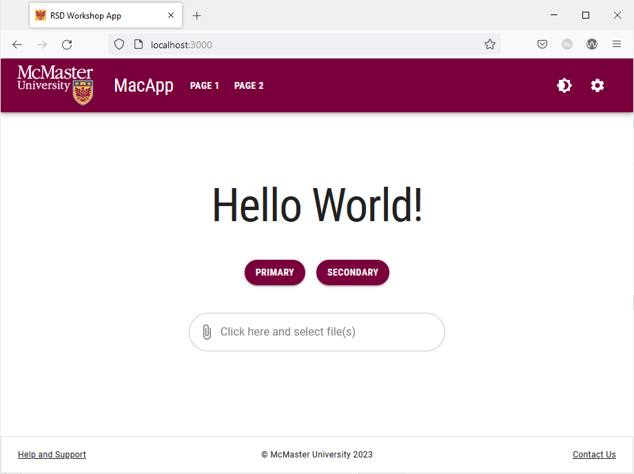
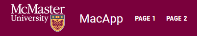
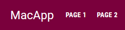
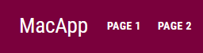
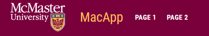
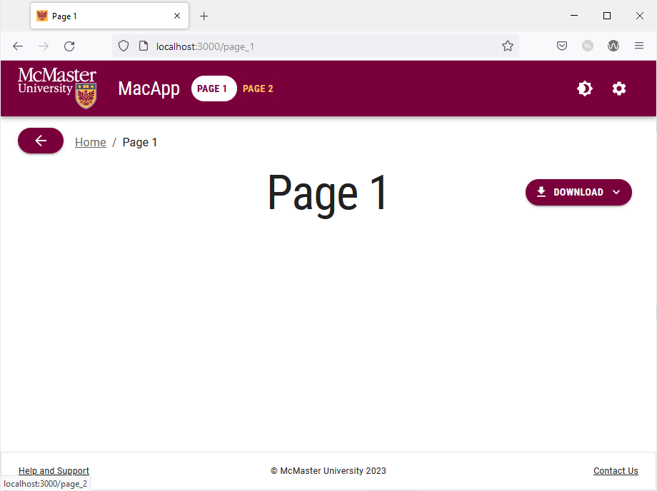
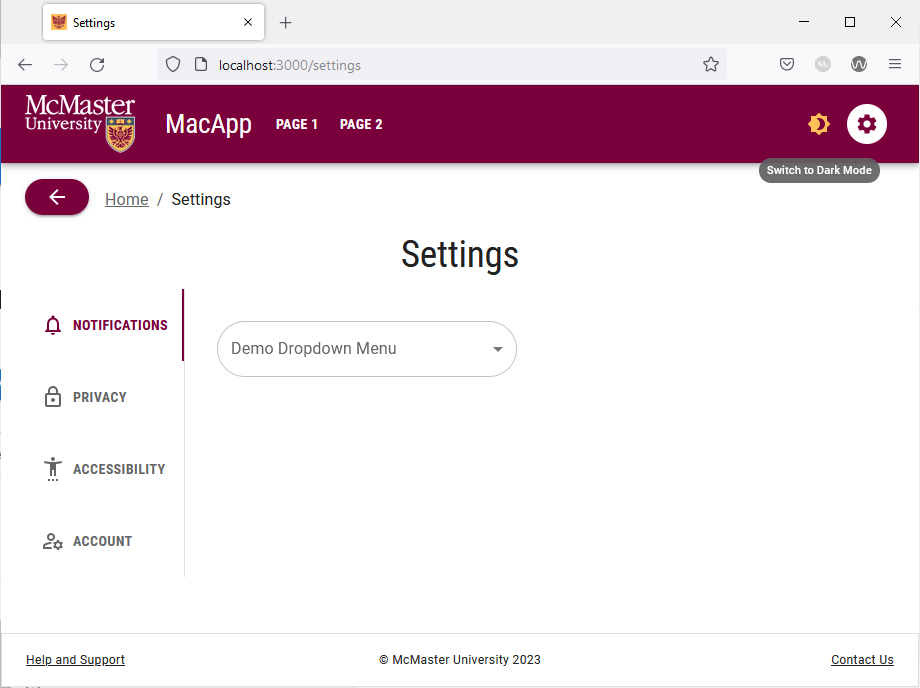

# Navigation Bar

We will now update our navigation bar to adhere to McMaster Digital Brand Standards:

## Define the Palette Colors & Border Radius
Start by defining the primary and secondary colors of your theme. The McMaster Digital Brand Standards specify that the primary color should be McMaster Heritage Maroon and the secondary color is McMaster Heritage Gold.

Modify `theme.ts` by adding the following code at the beginning of the `themeOptions` object:
```
palette: {  
	primary: {  
		main: "#7a003c"  
	},  
	secondary: {  
		main: "#fdbf57"  
	}  
},
```
In this code snippet, we are defining the primary and secondary colors of our website using the hex values that corresponding to the McMaster Heritage Maroon and Heritage Gold colors.

Next, we will set the border radius in the theme to 28 inside `themeOptions`:
```
shape: {  
	borderRadius: 28,  
},
```
Note that the shape `borderRadius` sets the global value of the border radius for all MUI components, we will modify the border radius of individual components as needed just like we did for the `MuiPaper` component.

Your `theme.ts` file should now look like this:
```
declare module '@mui/material/Typography' {
    interface TypographyPropsVariantOverrides {
        settingTitle: true;
    }
}

const themeOptions = {
	palette: {  
		primary: {  
			main: "#7a003c"  
		},  
		secondary: {  
			main: "#fdbf57"  
		}  
	},
    typography: {
        h1: {
            fontFamily: 'Roboto Condensed',
            fontSize: '50pt',
        },
        h2: {
            fontFamily: 'Roboto Condensed',
            fontSize: '28pt',
            fontWeight: 400,
        },
        h3: {
            fontFamily: 'Roboto Condensed',
            fontSize: '20pt',
        },
        h4: {
            fontFamily: 'Roboto',
            fontSize: '13pt',
            fontWeight: 900,
        },
        button: {
            fontFamily: 'Roboto Condensed',
            fontWeight: 700,
        },
    },
    shape: {  
		borderRadius: 28,  
	},
}

export default themeOptions
```

Save this file and go back to your browser. Your SPA will be automatically updated to use the Heritage Maroon color in lieu of the default MUI blue color. The buttons and the file picker on the main index page will now have rounder corners as well:



Try navigating to the different pages on this website and notice how the Heritage Maroon is applied to different components.

## Create `Navbar.module.css`
In the `styles` directory of your project, create a new file called `Navbar.module.css`. This file will contain the CSS styles used for the links in our navigation bar. We will define the colors of the links in their active, non-active and hover states:
- Non-active links should be white and turn heritage gold when you hover over them.
- Active links should have a white background and the link text should be heritage maroon.

Add the following lines to `Navbar.module.css`:

```
/* Specific styles for non-active navbar links */
.nonActive {
    color: white;
}

/* Specific styles for active navbar links */
.active {
    color: #7a003c;
    background: white;
}

.active:hover {
    color: #7a003c;
    background: white;
}

.title:hover {
    color: #fdbf57;
}
```

## Create Styled Buttons and Icon Buttons
We will now created styled buttons and icon buttons for use in our navigation bar. 

Create a new directory called `MacComponents` inside the `components` directory. Create a new file in this directory called `MacNavButton.tsx` and add the following code to it:

```
import {styled, useTheme} from '@mui/material/styles'
import Button from '@mui/material/Button'
import IconButton from '@mui/material/IconButton'

export const MacNavButton = styled(Button)(props => ({
    ':hover': {
        backgroundColor: '',
        color: useTheme().palette.secondary.main,
    },
    '&& .MuiTouchRipple-child': {
        backgroundColor: "#D6D6D6",
    },
})) as typeof Button

export const MacIconNavButton = styled(IconButton)(props => ({
    ':hover': {
        backgroundColor: "transparent",
        color: useTheme().palette.secondary.main,
    },
    '&& .MuiTouchRipple-child': {
        backgroundColor: "#D6D6D6",
    },
})) as typeof IconButton
```

We set the hover color to heritage gold and make the background transparent when hovering over the icon button. We also added a ripple affect to the buttons that appears when the user clicks on it. 

## Update `Navbar.tsx`
Open the `components/Navbar/Navbar.tsx` file and add the following import statements:
```
import styles from '@/styles/NavBar.module.css'  
import {MacIconNavButton, MacNavButton,} from '@/components/MacComponents/MacNavButton'
```

Next, we will add the McMaster logo to the left-hand side of the navigation bar. Add the following lines of code before the `Typography` component containing the "MacApp" string:
```

<Box
	component="img"
	sx={{
		height: 78.31,
		width: 140,
		display: 'flex'
	}}
	alt="McMaster Logo"
	src="/assets/logo.png"
	style={imgStyle}
/>

```

Your navigation bar will now look like this:


Update the `Typography` component containing the "MacApp" string by changing the variant from `h3` to `h5` and adding the following prop `className={styles.title}` after the `sx` prop. The typography component should now look like this:
```

<Typography
	variant="h3"
	noWrap
	component={Link}
	href="/"
	sx={{
		mr: 2,
		display: 'flex',
		textDecoration: 'none',
		color: 'inherit',
	}}
	className={styles.title}
>
	MacApp
</Typography>

```

Old "MacApp" Title           |  Styled "MacApp" Title
:-------------------------:|:-------------------------:
  |  

We used the `classNames` prop to indicate that the "MacApp" `typography` component should use the `title` CSS style define in `Navbar.module.css`. 
Try hovering over the "MacApp" title in your browser, the text should turn Heritage Gold to indicate that it is a clickable link as shown in the image below.



We will now update the page links in the navigation to change color when the user hovers over them and have an active indicator. 
Inspect the `Box` component after the the `Typography` component containing the "MacApp" string. Notice that the page links are rendered using the standard MUI `Button` component.
We will modify the page links to use the custom `MacNavButton` component that we created earlier instead of the standard MUI `Button` component as shown in the code snippet below:
```

<Box sx={{flexGrow: 1, display: 'flex'}}>
	{pages.map(page => (
		<MacNavButton
			key={page[0]}
			component={Link}
			href={page[1]}
			sx={{my: 2, color: 'white', display: 'block'}}
			className={
				currentRoute === page[1]
					? styles.active
					: styles.nonActive
			}
>
			{page[0]}
		</MacNavButton>
	))}
</Box>

```
We also conditionally set the `className` prop to display a white oval-shaped background on the button corresponding to the current active page.



Similarly, we will update the icon buttons in the navigation bar to use the aforementioned hover and active styles.

Locate the `IconButton` component containing the  `<Brightness4Icon />` and `<Brightness4Icon />` components and change it to a `MacIconNavButton` component as show below:
```

<MacIconNavButton
	sx={{ml: 1}}
	color="inherit"
>
	{theme.palette.mode === 'dark' ? (
		<Brightness7Icon />
	) : (
		<Brightness4Icon />
	)}
</MacIconNavButton>
s
```

Next, change the `IconButton` component containing the `<SettingsIcon />` component to a `MacIconNavButton` controller and add the `classNames` prop:
```
<MacIconNavButton
	aria-label="settings"
	color="inherit"
	component={Link}
	href="/settings"
	className={
		currentRoute === '/settings'
			? styles.active
			: styles.nonActive
	}
>
	<SettingsIcon />
</MacIconNavButton>
```

The icon buttons in the navigation bar will now turn Heritage Gold when you hover over them. The settings page will also have an active indicator when you are on this page.



