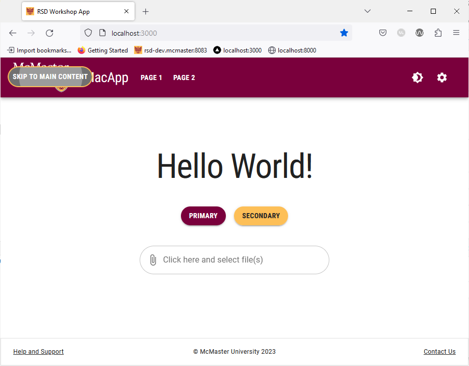

# "Skip to Main Content" Button

Many modern websites have a consistent set of UI elements at top of every page. The content commonly includes a header with the brand logo and a navigation bar. If a user navigates the same site regularly, they will probably find themselves navigating through these UI elements regularly to get to the main content on the page, which can be tedious and detrimental to the overall user experience. As such, developers started adding a "Skip to Main Content" button to their webpages. These anchor buttons are meant to be used as the first element that a user can tab to when they first load a webpage. In this section, we will learn how to add a "Skip to Main Content" button to our Next.js application.

## Create `SkipLink` and `SkipButton` Components
We will start by creating the custom components needed to render the "Skip to Main Content" button.

Create a `SkipLink` directory inside the `components` directory. Next, create a `SkipLink.tsx` file inside the `SkipLink` directory and add the following lines of code to it:

```ts
import React from 'react';

interface SkipLinkProperties {
    className?: string;

    children: React.ReactElement;
    /**
     * The css query aiding the selection of the
     * container (main, section etc) we want to scroll to;
     */
    skipTo: string;
}

const SkipLink: React.FC<SkipLinkProperties> = props => {

    const onClick = (event: React.SyntheticEvent) => {
        event.preventDefault();

        const container: (HTMLElement | null) = document.querySelector(props.skipTo);

        if (container) {
            container.tabIndex = -1;
            container.focus();
            setTimeout(() => container.removeAttribute("tabindex"), 1000);
        }
    };

    return React.cloneElement(props.children, { onClick, className: props.className });
}

export default SkipLink;
```

We created re-usable component that encapsulates the desired "Skip to Main Content" functionality. `SkipLink.tsx` includes an `onClick` event handler that will be forwarded to any children component nested inside the `SkipLink` component. Notice that the `SkipLink` component has two props: a `ClassName` used to specify the CSS class and a `SkipTo` string containing the CSS query used to determine which component we want to skip to. 

Our next step is to create a custom `SkipButton` component that we will nest inside the `SkipLink` component.

Create a `SkipButton.tsx` file inside the `SkipLink` directory and add the following lines of code to it:

```ts
import {useTheme} from '@mui/material/styles'
import styled from '@emotion/styled'
import MuiButton, {ButtonProps} from '@mui/material/Button'

interface SkipButtonProps extends ButtonProps {
    mainColor: string
}

export const SkipButton = styled(MuiButton, {
    shouldForwardProp: prop => prop !== 'mainColor',
})<SkipButtonProps>(props => ({
    backgroundColor: useTheme().palette.secondary.main,
    color: '#262626',
    "&:focus-visible": {
        color: 'white',
        backgroundColor: '#707070',
        outline: '2px solid #fdbf57',
    },
}))
```

We customized the color and focus behavior of the `SkipButton` component to ensure that the focus indicator is visible against the navigation bar.

We will be making use of Sass (**S**yntactically **A**wesome **S**tyle**s**heet), which is an extension of CSS, to ensure that the `SkipLink` components slides on the screen from the left-hand side.

Start by installing the `sass` package using `npm`:
```shell
npm i sass
```

Next, add the Sass styles for the `SkipLink` component by creating a `SkipLink.module.scss` file inside the `styles` directory.

Add the following lines of code `SkipLink.modukle.scss`:
```scss
.skipLink {
  margin-right: 1rem;
  position: absolute;
  transform: translateX(-200%);
  transition: transform 0.3s;

&:focus {
   position: absolute;
   transform: translateX(0);
 }
}
```

Finally, we will make use of the `SkipLink` and `SkipButton` components in the navigation bar. Open the `Navbar/Navbar.tsx` file located inside the `components` directory and add the following import statements:
```ts
import SkipLink from "@/components/SkipLink/SkipLink";  
import {SkipButton} from "@/components/SkipLink/SkipButton";  
import styles_skip from '@/styles/SkipLink.module.scss'
```

Add the following lines of code **before** the `<Container maxWidth="xl">` line:

```ts
<Box sx={{zIndex: 1300}}>
	<SkipLink className={styles_skip.skipLink} skipTo={"main:first-of-type"}>
		<SkipButton mainColor={"primary"} sx={{marginTop:2.4, marginLeft:2, color: 'white'}}>Skip to main content</SkipButton>
	</SkipLink>
</Box>
```

The `Box` containing the "Skip to Main Content" button has the `zIndex` property set to `1300` to ensure that the button always renders on top of other components. We set the `className` prop of the `SkipLink` component to the style defined in the `SkipLink.modue.scss` file. The `skipTo` string is set to `"main:first-of-type"`, i.e., we want to skip to the first component that has `main` as its class.

Save the file and go back your browser, then reload the page. If you encounter errors, simply stop the current running `dev` instance by going to the terminal and clicking "Ctrl + C", then "Y" to confirm. 

Once the page is loaded, try pressing the Tab key on your keyboard. The "Skip to Main Content" button should slide from the left-hand side of the navigation bar.



Try pressing the "Enter" key on your keyboard when the "Skip to Main Content" button is shown. You can then press "Tab" again to navigate the main content of the page without going through the navigation bar buttons.


