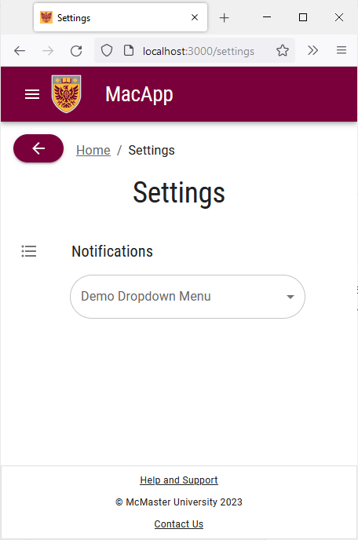
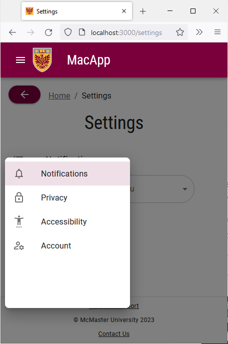

# Vertical Tabs

The vertical tabs we created for the "Settings" page do not scale properly on mobile devices. We will modify the `VerticalTabs` component to use a small drawer for switching tabs on the "Settings" page when viewed on a small screen.

## Limit Current Configuration to Medium/Large Displays
We will start by limiting the current tabs setup to medium and large display using breakpoints.

Open the `components/TabPanel/VerticalTabs.tsx` file and replace the `display: 'flex'` line inside the `Tabs` component with `display: {xs: 'none', md: 'flex'}`.

## Add Drawer
Start by adding the following import statements to `VerticalTabs.tsx`:
```ts
import Drawer from '@mui/material/Drawer';  
import List from '@mui/material/List';  
import ListItem from '@mui/material/ListItem';  
import ListItemButton from '@mui/material/ListItemButton';  
import ListItemIcon from '@mui/material/ListItemIcon';  
import ListItemText from '@mui/material/ListItemText';  
import FormatListBulletedOutlinedIcon from '@mui/icons-material/FormatListBulletedOutlined';  
import IconButton from "@mui/material/IconButton";
```

Next, add the following lines of code before the `return` statement:
```ts

// function that handles changing tabs in the tabs drawer
const handleChangeDrawer = (e: React.MouseEvent<HTMLDivElement>, newValue: number) => {
	setValue(newValue);
}

// declaring a state variable that determines if the tabs drawer is open and initializing it to false
const [state, setState] = React.useState(false);

// function used to open and close the tabs drawer
const toggleDrawer =
	(open: boolean) =>
		(event: React.KeyboardEvent | React.MouseEvent) => {
			if (
				event.type === 'keydown' &&
				((event as React.KeyboardEvent).key === 'Tab' ||
					(event as React.KeyboardEvent).key === 'Shift')
			) {
				return;
			}
			setState(open);
		};

// function used to render the items inside the tabs drawer
const list = () => (
	<Box
		sx={{ width:  250 }}
		role="presentation"
		onClick={toggleDrawer(false)}
		onKeyDown={toggleDrawer(false)}
>
		<List>
			{tabs.map((text, index) => (
				<ListItem key={text} disablePadding>
					<ListItemButton selected= {value === index} onClick={(e) => handleChangeDrawer(e, index)}>
						<ListItemIcon>
							{icons[index]}
						</ListItemIcon>
						<ListItemText primary={text} />
					</ListItemButton>
				</ListItem>
			))}
		</List>
	</Box>
);

```

The `toggleDrawer` function handles opening and closing the drawer using the `state` constant. The `list` function renders the components inside the drawer. Akin to the `Tabs` component, the drawer contains four tabs with appropriate iconography. The `selected= {value === index}` line in the `ListItemButton` component is used to highlight the tab that the user currently has open by comparing the `value` prop of the `TabPanel` component to the `index` of the tab.

We will now add the UI elements that should only be visible on smaller screens. We will add an `IconButton` to open and close the `Drawer` component.

Add the following lines of code right after the `Tabs` closing tag inside the `return` statement:
```ts

{/* adding an icon button to open/close the drawer on mobile devices */}
<Box sx={{paddingTop: '19px'}}>
	<IconButton title="Settings Drawer" aria-label="settings-menu" onClick={toggleDrawer(true)} sx={{ display: {xs: 'inline', md: 'none'}, height:'40px'}}> <FormatListBulletedOutlinedIcon /> </IconButton>
</Box>
{/* rendering the Drawer component */}
<Drawer
	anchor={"left"}
	open={state}
	onClose={toggleDrawer(false)}
	sx={{
		'& .MuiDrawer-root': {
			position: 'absolute'
		},
		'& .MuiPaper-root': {
			position: 'absolute'
		},
		minWidth: 100,
		width: "20%",
		position: "absolute",
		top: '230px',
		left: '2%',
		height: '50%',
		display: {xs: 'flex', md: 'none'}
	}}                        
>
	{list() /* calling list() to render the content of the tabs drawer */}
</Drawer>

```

We will also add a title to each panel that is only visible on small screens since the tab names are no longer visible when the user is on each tab.

Modify each `TabPanel` component by adding a `Typography` component to it and only displaying it on small screens using breakpoints:
```ts

<TabPanel value={value} index={0}>
	{/* adding a Typography component with the title of the active tab (only visible on small screens) */}
	<Typography
		sx={{display: {xs: 'flex', md: 'none'}, justifyContent: 'left', paddingLeft: '10px'}}
		gutterBottom
>
		Notifications
	</Typography>
	<FormControl sx={{m: 1, minWidth: 300}}>
		<InputLabel id="demo-simple-select-label">
			Demo Dropdown Menu
		</InputLabel>
		<Select
			labelId="demo-simple-select-label"
			id="demo-simple-select"
			label="Demo Dropdown Menu"
>
			<MenuItem value={1}>Option 1</MenuItem>
			<MenuItem value={2}>Option 2</MenuItem>
			<MenuItem value={3}>Option 3</MenuItem>
		</Select>
	</FormControl>
</TabPanel>
<TabPanel value={value} index={1}>
	<Typography
		sx={{display: {xs: 'flex', md: 'none'}, justifyContent: 'left', paddingLeft: '10px'}}
		variant="h3"
		gutterBottom
>
		Privacy
	</Typography>
	Placeholder 2
</TabPanel>
<TabPanel value={value} index={2}>
	<Typography
		sx={{display: {xs: 'flex', md: 'none'}, justifyContent: 'left', paddingLeft: '10px'}}
		variant="h3"
		gutterBottom
>
		Accessibility
	</Typography>
	Placeholder 3
</TabPanel>
<TabPanel value={value} index={3}>
	<Typography
		sx={{display: {xs: 'flex', md: 'none'}, justifyContent: 'left', paddingLeft: '10px'}}
		variant="h3"
		gutterBottom
>
		Account
	</Typography>
	Placeholder 4
</TabPanel>

```

Notice that we used a custom `Typography variant` that we defined earlier in `theme.ts` for these titles.

Save the file and go back to your browser. Try shrinking the window and notice how the tabs are replaced with a drawer.



We also retain an active indicator to inform the user of the current tab that they are on.

