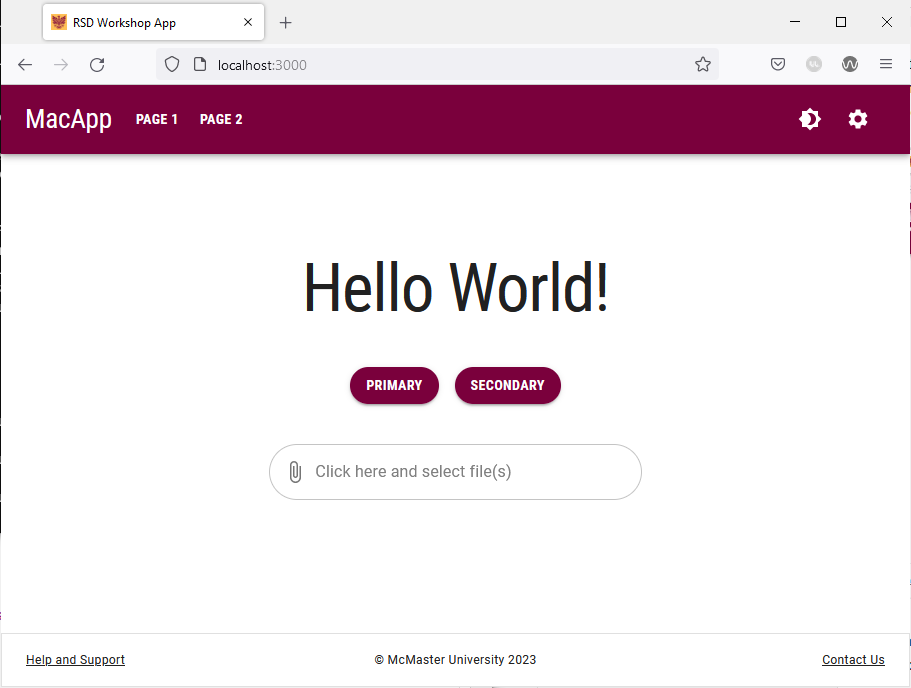

# Theming

Material UI streamlines the theming process by allowing developers to define the primary and secondary colors of their theme as well as the geometric characteristics of components in a theme file. We will now proceed to define our theme colors as shown below:

## Define the Palette Colors & Border Radius
Start by defining the primary and secondary colors of your theme. The McMaster Digital Brand Standards specify that the primary color should be McMaster Heritage Maroon and the secondary color is McMaster Heritage Gold.

Modify `theme.ts` by adding the following code at the beginning of the `themeOptions` object:
```
palette: {  
	primary: {  
		main: "#7a003c"  
	},  
	secondary: {  
		main: "#fdbf57"  
	}  
},
```
In this code snippet, we are defining the primary and secondary colors of our website using the hex values that correspond to the McMaster Heritage Maroon and Heritage Gold colors.

Next, we will set the border radius in the theme to 28 inside `themeOptions`:
```
shape: {  
	borderRadius: 28,  
},
```
Note that the shape `borderRadius` sets the global value of the border radius for all MUI components, we will modify the border radius of individual components as needed in future sections of this workshop.

Your `theme.ts` file should now look like this:
```
declare module '@mui/material/Typography' {
    interface TypographyPropsVariantOverrides {
        settingTitle: true;
    }
}

const themeOptions = {
	palette: {  
		primary: {  
			main: "#7a003c"  
		},  
		secondary: {  
			main: "#fdbf57"  
		}  
	},
    typography: {
        h1: {
            fontFamily: 'Roboto Condensed',
            fontSize: '50pt',
        },
        h2: {
            fontFamily: 'Roboto Condensed',
            fontSize: '28pt',
            fontWeight: 400,
        },
        h3: {
            fontFamily: 'Roboto Condensed',
            fontSize: '20pt',
        },
        h4: {
            fontFamily: 'Roboto',
            fontSize: '13pt',
            fontWeight: 900,
        },
        button: {
            fontFamily: 'Roboto Condensed',
            fontWeight: 700,
        },
    },
    shape: {  
		borderRadius: 28,  
	},
}

export default themeOptions
```

Save this file and go back to your browser. Your SPA will be automatically updated to use the Heritage Maroon color in lieu of the default MUI blue color. The buttons and the file picker on the main index page will now have rounder corners as well:



Try navigating to the different pages on this website and notice how the Heritage Maroon color is applied to different components.
