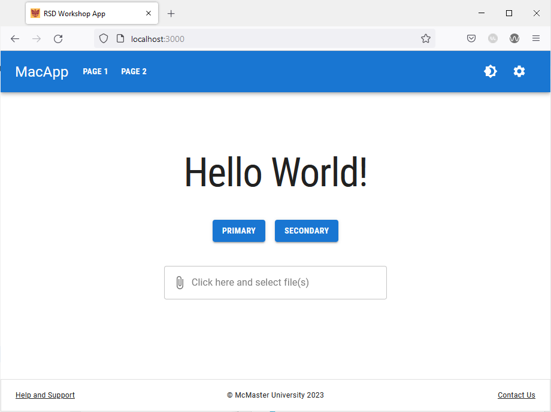
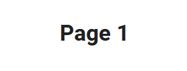
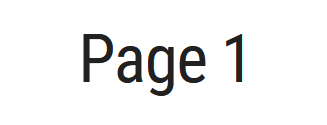
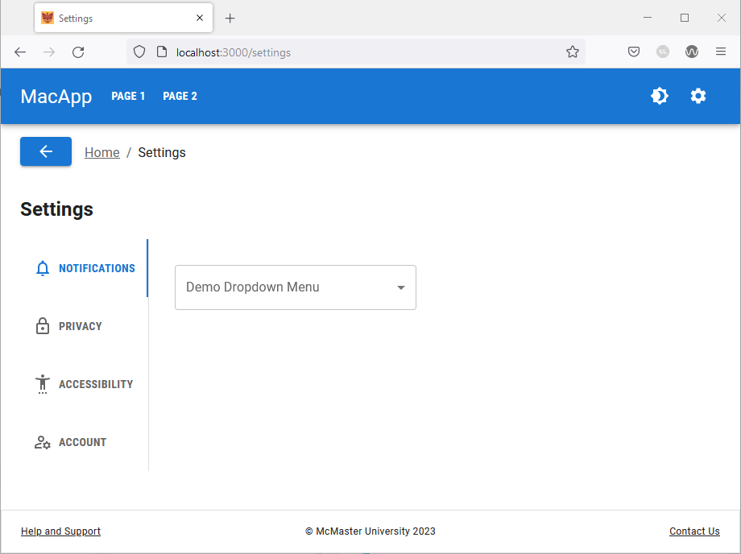

# Typography

McMaster recommends the use of the Roboto family of fonts on all websites associated with the university. 
To add the Roboto family of fonts to your SPA follow the steps below:

## Define the Typography Styles
Open the `_document.tsx` file located in the `pages` directory and modify line 6 as follows by deleting `<Head />` and replacing it with:
```
<Head >  
	<link  
	rel="stylesheet"  
	href="https://fonts.googleapis.com/css?family=Roboto:300,300i,700,700i|Roboto+Condensed:400,400i,700,700i|&display=swap"  
	/>  
</Head>
```
This line of code download the needed Roboto font variants from the Google Fonts.

The `_document.tsx` file should now contain the following code:
```
import { Html, Head, Main, NextScript } from 'next/document'  
  
export default function Document() {  
	return (  
		<Html lang="en">  
			<Head >  
				<link  
					rel="stylesheet"  
					href="https://fonts.googleapis.com/css?family=Roboto:300,300i,700,700i|Roboto+Condensed:400,400i,700,700i|&display=swap"  
				/>  
			</Head>  
			<body>  
				<Main />  
				<NextScript />  
			</body>  
		</Html>  
	)  
}
```

## Create `theme.ts`
In the root directory of your project, create a new directory named `config`. You can create the folder using the command line (`mkdir config`) or the GUI.
Navigate to the newly created `config` directory, and create a new file called `theme.ts` in this directory.

Add the following code snippet to  `theme.ts`:
```
declare module '@mui/material/Typography' {
    interface TypographyPropsVariantOverrides {
        settingTitle: true;
    }
}

const themeOptions = {
    typography: {
        h1: {
            fontFamily: 'Roboto Condensed',
            fontSize: '50pt',
        },
        h2: {
            fontFamily: 'Roboto Condensed',
            fontSize: '28pt',
            fontWeight: 400,
        },
        h3: {
            fontFamily: 'Roboto Condensed',
            fontSize: '20pt',
        },
        h4: {
            fontFamily: 'Roboto',
            fontSize: '13pt',
            fontWeight: 900,
        },
        button: {
            fontFamily: 'Roboto Condensed',
            fontWeight: 700,
        },
        settingTitle: {  
			fontFamily: 'Roboto Condensed',  
			fontSize: '15pt',  
		},
    },
}

export default themeOptions
```

In this code snippet, we are defining the different typography variant that can be use in our application. The heading styles conform to the McMaster Digital Brand Standards. The `button` and `settingTitle` typographies define the font style to use for text located in buttons and setting titles respectively. We will cover styling buttons and setting pages in later sections of this workshop.

## Create a Theme Provider
Open the `_app.tsx_` file located in the `pages` directory and add the following import statements:
```
import {createTheme, ThemeProvider} from '@mui/material/styles'  
import themeOptions from '@/config/theme'
```

Create the `theme` constant in the `App` function (before the `return` statement):
```
const theme = createTheme({  
...themeOptions  
});
```
Notice that the theme uses the `themeOptions` defined in and imported from `theme.ts`.

Update the return statement by wrapping its content with a `ThemeProvider` as shown below:
```
return <>
	<ThemeProvider theme={theme}>
		<Navbar />
		<CssBaseline />
		<Component {...pageProps} />
		<Footer />
	</ThemeProvider>
</>
```
Your `_app.tsx` file should now look like this:
```
import type { AppProps } from 'next/app'
import CssBaseline from '@mui/material/CssBaseline'
import Navbar from "@/components/Navbar/Navbar";
import Footer from "@/components/Footer/Footer";
import {createTheme, ThemeProvider} from '@mui/material/styles'
import themeOptions from '@/config/theme'

export default function App({ Component, pageProps }: AppProps) {
    const theme = createTheme({
        ...themeOptions
    });

    return <>
        <ThemeProvider theme={theme}>
            <Navbar />
            <CssBaseline />
            <Component {...pageProps} />
            <Footer />
        </ThemeProvider>
    </>
}

```

## Use the Typography Component

### Update `pages/index.tsx`
Open the `pages/index.tsx` file and add the following import statement to import the MUI Typography component:
```
import Typography from '@mui/material/Typography'
```
Delete the line containing the `<h1>` tag inside the `Stack` component and replace it with the following line of code:
```
<Typography variant="h1">Hello World!</Typography>
```

Save the file and go back the browser, your webpage should now look like this:


Notice the following changes:
- The "Hello World!" text now uses the `h1` style defined in `theme.ts`.
- Buttons on the index page as well as in the navigation bar now use the `button` typography style defined in `theme.ts`.

### Update `page_1/index.tsx`
Open the `pages/page_1/index.tsx` file and import the MUI Typography component:
```
import Typography from '@mui/material/Typography'
```
Delete the line containing the `<h1>` tag inside the `Box` component and replace it with the following line of code:
```
<Typography variant="h1">Page 1</Typography>
```

The "Page 1" title text will be updated as shown below:

Using `h1` tag            |  Using `Typogrpahy` component (`h1` variant)
:-------------------------:|:-------------------------:
  |  

### Update `page_2/index.tsx`
Repeat the process above for "Page 2".
Add the following import statement:
```
import Typography from '@mui/material/Typography'
```
Delete the line containing the `<h1>` tag inside the `Box` component and replace it with the following line of code:
```
<Typography variant="h1">Page 2</Typography>
```

### Update `support/index.tsx`
Add the following import statement:
```
import Typography from '@mui/material/Typography'
```
Delete the line containing the `<h1>` tag inside the `Box` component and replace it with the following line of code:
```
<Typography variant="h1">Help and Support</Typography>
```

### Update `settings/index.tsx`



Add the following import statement:
```
import Typography from '@mui/material/Typography'
```
Delete the line containing the `<h2>` tag after the `Breadcrumbs` component and replace it with the following line of code:
```

<Typography
	sx={{display: 'flex', justifyContent: 'center'}}
	variant="h2"
	gutterBottom>
	Settings
</Typography>

```
We used the `sx` prop to center the "Settings" title and we used the `gutterBottom` prop to add a bottom margin to the title.

Following these changes, the "Settings" page should now look like this:


You can use any the typography styles defined in `theme.ts` by specifying the variant in the `Typography` component. You can also define additional styles and use them in your SPA.
