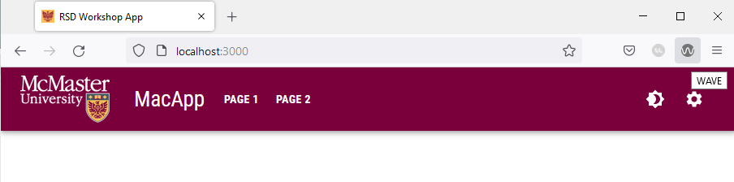

# The WAVE Tool 

The WAVE tool is a browser extension that contains a number of evaluation tools to help developers make their web content more accessible to individuals with disabilities. WAVE can identify many accessibility and Web Content Accessibility Guideline (WCAG) errors and provides helpful hints to address the errors.

### Installing the WAVE Browser Extension
Open the [WAVE Extensions ](https://wave.webaim.org/extension/) webpage and install the WAVE extension for the browser that you are currently using. 

### Using the WAVE Browser Extension
To evaluate a page, simply click on the extension button in your browser's toolbar.

The WAVE sidebar will be shown on the top right side of your browser. The sidebar includes a summary of all the errors, alerts and features that are present on the page you have open.

You will need to evaluate all pages of your website across their different variations using this tool. For instance, if your website has a light and a dark mode, you will need to evaluate each page in both modes. Furthermore, if you have some UI elements that only appear in certain conditions (e.g., mobile/tablet UI, etc.), you will have to evaluate each page in all its variations. 
